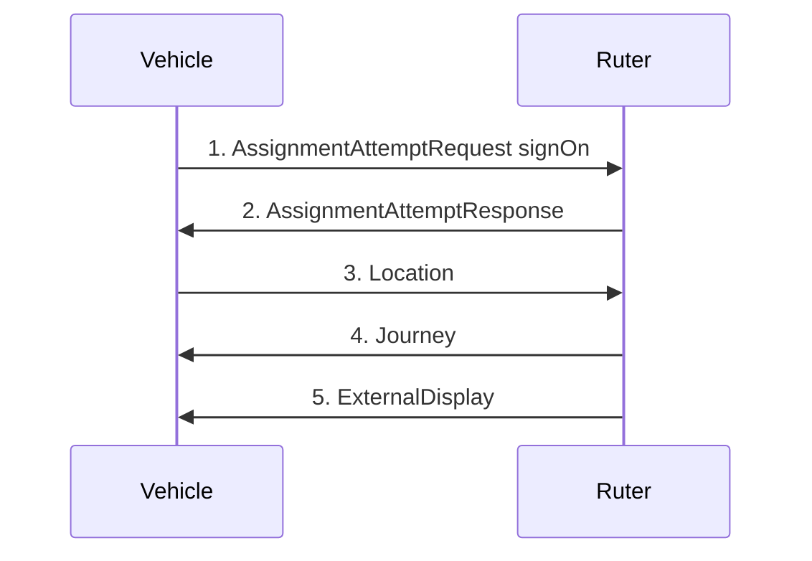

## Ruters digitale plattform
This specification contains interfaces to be used between PTOs (operators) and Ruter.
The API describes a set of MQTT topics which are used to distribute data onboard public transport vehicles/vessels as
well as between the vehicle/vessel and Ruter’s Back Office or vv.

### General information
#### Upgrades to the API
The API follows the upgrade cycles of ADT. Major releases are done more or less once a year and usually include breaking changes.

Minor/build releases are performed as continual deliveries and are non-breaking. New versions of this document will be published when new topics and/or fields are added.

#### Consumer Client Requirements
Clients consuming information posted on the topics must be tolerant to:
- That optional properties can be null or left out.
- That arrays can contain any number of elements including zero.
- That returned data can be extended with new properties without notice.

#### Quality of Service, Retained Flag and Persistence
Generally, QoS level 1 is applied for most topics and the `retain` flag is true for most topics. See the respective topic for precise info.

Subscribers should start with Clean Session set to True to assure that they get the latest information at reconnection (the retained info) and avoid first having to process a long queue of outdated old information that in reality hinders new relevant information to reach the subscriber.

#### Translation of topic names
Global topic names are generally written on the format of `{recipient}/{sender}/{vehicleid}/{topic}` to make it easy to identify the source and destination of the messages.
Local topic names have omitted the `{recipient}/{sender}/{vehicleid}` part in order to have onboard equipment pre-configured with vehicle independent settings.

All topic names must thus be rewritten local/global in the MQTT bridge according to a provided configuration file.

#### Data format
All data must be JSON and UTF-8 encoded.

### Overview

The diagram below shows an overview of the most important messages that manage the assignment and journey of a vehicle.

1. The vehicle signs on
2. Ruter sends a response with the status of the signon
3. Based on the location of the vehicle, Ruter calculates which journey in the assignment the vehicle is on, which stop it is going to next, etc.
4. If the position matches a journey in the assignmment, Ruter sends a journey message to the vehicle, 
5. ...and Ruter changes external display

### More info
For more information, please go to: [Ruter’s ADT agreement](https://ruter.atlassian.net/wiki/spaces/DS/pages/231178249/Avtale+om+Digitale+Tjenester "https://ruter.atlassian.net/wiki/spaces/DS/pages/231178249/Avtale+om+Digitale+Tjenester").

### Comments or suggestions
Please open an issue here: [ADT-DOC Issues](https://github.com/RuterNo/adt-doc/issues) 
