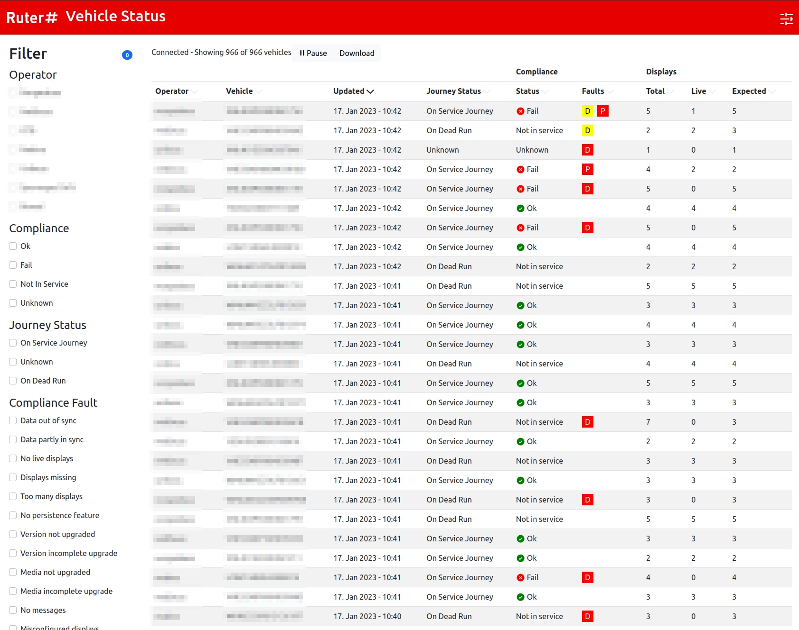

# Vehicle Status - Live information

## Introduction  
In an effort to make it easier for PTOs of having a overview of the current status of their vehicles, 
Ruter has created a simple status page showing Live information of SLA requirements. 

!!! note "Notice!"
    This application is provided on a best-effort basis, meaning Ruter bears no responsibility for any trouble the PTOs 
    may experience in case of service downtime or invalid information provided. 

> [https://vehicle-status.transhub.io](https://vehicle-status.transhub.io)

## Data source

!!! note "Notice!"
    This application has been made to assist operators in identifying issues with their equipment.
    The original data source used here is the same as the one used by Ruter to calculate SLA for DPI displays. 
    However, **this API is not intended for calculating SLA breaches.**

All data shown in the Vehicle Status page comes from the mqtt-topic described here: 

[SLA Insight](../insight)

## Authentication

When first visiting the page, you will be asked to enter MQTT: 

- host
- username 
- password

On later visits, these are remembered in the browser. Take care not to leave any authentication credentials on public
computers. 

It is recommended to use user accounts with READ-ONLY permissions, as the application is view only. 
