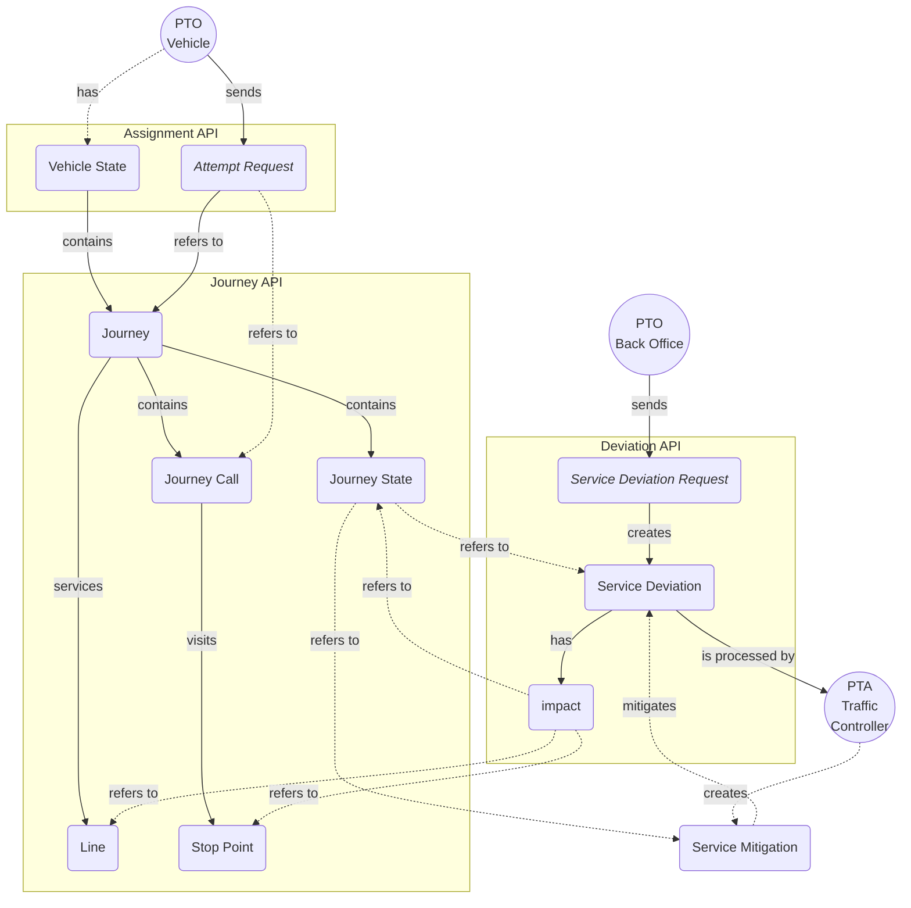
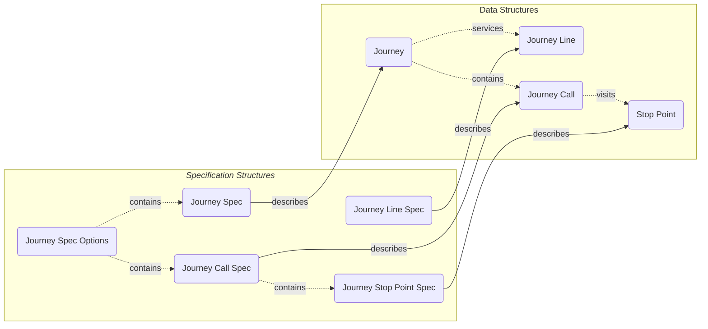

# Operational API
> This api is a draft until further notice

[OpenAPI Specification Documentation](openapi/operational/index.html){target=_blank .md-button }

## Introduction

The ADT Operational API consists of three separate, but related functional areas:

1. [Journey API endpoints](#journey-api), for looking up up-to-date lines, stop points and journeys.
2. [Assignment API endpoints](#assignment-api), for signing vehicles on and off journeys as they are being operated.
3. [Service Deviation API endpoints](#deviation-api), for notifying about deviations from planned operations delivery.

### Data Model



_Simplified data model with relationships and data flow for operational APIs._

#### Journey Identifiers

When looking up journeys via the [Journey API](#journey-api), a set of three identifiers are returned for each journey:

1. `vehicleJourneyId`: Vehicle journey id assigned by PTA traffic planner. Reused across multiple operating dates.
2. `serviceJourneyId`: Service journey id assigned by PTA back-end system. Reused across multiple operating dates.
3. `datedServiceJourneyId`: Dated service journey id assigned by PTA back-end system. Unique for a specific service journey on a
    specific date.

Of these, 1.) and 2.) may be reused across multiple operating days and are therefore not unique for a specific date.

#### Journey Specification Options



_Simplified data model with relationships between specification structures and the objects they describe._

Since not all journey identifiers are unique across operating days, when signing on a vehicle via the
[Assignment API](#assignment-api) or registering a service deviation for a journey via the
[Service Deviation API](#deviation-api), some additional details may be required to uniquely identify a journey
on a specific date.

This structure is modeled as _journey specification options_, each describing a specific (planned) journey, a subset of
calls in a (planned) journey or an unplanned _"ad-hoc"_ journey with two properties:

1. `calls`, a list of [journey call specifications](#journey-call-specifications) identifying specific calls in a
   journey or an ad-hoc journey.
2. `journey`, a  [journey specifications](#journey-specifications) identifying a specific (planned) journey.

##### Journey Specifications

Certain API requests allow the client to provide a list of journeys when signing on a vehicle or
registering a service deviation. In such requests, the _journey specification_ structure describes a specific (planned)
journey on a specific date:

1. `lineId`, a line identifier, such as `RUT:Line:xxx`.
2. `journeyId`, one of `vehicleJourneyId`, `serviceJourneyId` or `datedServiceJourneyId`.
3. `serviceWindow`, a date-time range with a `start` and `end` timestamp, describing the complete or partial service
   window of the journey.

###### Mapping NeTEx Data to Journey Specifications

Example _PublicationDelivery_ section from NeTEx data file format:

```xml
<?xml version="1.0" encoding="UTF-8" standalone="yes"?>
<PublicationDelivery>
  <dataObjects>
    <CompositeFrame>
      <frames>
        <ServiceFrame>
          <routes>
            <Route id="RUT:Route:007">
              <LineRef ref="RUT:Line:1337"/>
            </Route>
          </routes>
          <lines>
            <Line id="RUT:Line:1337">
            </Line>
          </lines>
          <journeyPatterns>
            <JourneyPattern id="RUT:JourneyPattern:123456">
              <RouteRef ref="RUT:Route:007"/>
            </JourneyPattern>
          </journeyPatterns>
        </ServiceFrame>
        <TimetableFrame>
          <vehicleJourneys>
            <ServiceJourney id="RUT:ServiceJourney:1">
              <JourneyPatternRef ref="RUT:JourneyPattern:123456"/>
              <PrivateCode>505</PrivateCode>
              <passingTimes>
                <TimetabledPassingTime>
                  <StopPointInJourneyPatternRef/>
                  <DepartureTime>03:28:00</DepartureTime>
                </TimetabledPassingTime>
                <TimetabledPassingTime>
                  <StopPointInJourneyPatternRef/>
                  <DepartureTime>03:31:00</DepartureTime>
                </TimetabledPassingTime>
                <TimetabledPassingTime>
                  <StopPointInJourneyPatternRef/>
                  <ArrivalTime>03:33:00</ArrivalTime>
                </TimetabledPassingTime>
              </passingTimes>
            </ServiceJourney>
            <DatedServiceJourney id="RUT:DatedServiceJourney:a">
              <ServiceJourneyRef ref="RUT:ServiceJourney:1"/>
              <OperatingDayRef ref="RUT:OperatingDay:2024-01-01"/>
            </DatedServiceJourney>
          </vehicleJourneys>
        </TimetableFrame>
      </frames>
    </CompositeFrame>
  </dataObjects>
</PublicationDelivery>
```

Resolved values from above example for use in journey specification:
-  **lineId**: `RUT:Line:1337` value from
    ```
    PublicationDelivery/dataObjects/CompositeFrame/frames/ServiceFrame/lines/Line/@id
    ```
- **journeyId**: either of
    1. _vehicle journey id_ value `505` from
        ```
        PublicationDelivery/dataObjects/CompositeFrame/frames/TimetableFrame/vehicleJourneys/ServiceJourney/PrivateCode
        ```
    2. _service journey Id_ value `RUT:ServiceJourney:1` from
        ```
        PublicationDelivery/dataObjects/CompositeFrame/frames/TimetableFrame/vehicleJourneys/ServiceJourney/@Id
        ```
    3. _dated service journey id_ value `RUT:DatedServiceJourney:a` from
        ```
        PublicationDelivery/dataObjects/CompositeFrame/frames/TimetableFrame/vehicleJourneys/DatedServiceJourney/@id
        ```

- **serviceWindow.start**: value `2024-01-01T03:28:00+01:00`, constructed by combining
  - date of service
  - departure time of earliest passing from
    ```
    PublicationDelivery/dataObjects/CompositeFrame/frames/TimetableFrame/vehicleJourneys/ServiceJourney/passingTimes/TimetabledPassingTime/DepartureTime
    ```
  - current time-zone offset (CET).

- **serviceWindow.end**: value `2024-01-01T03:33:00+01:00`, constructed by combining
  - date of service
  - arrival time of latest passing time from
    ```
    PublicationDelivery/dataObjects/CompositeFrame/frames/TimetableFrame/vehicleJourneys/ServiceJourney/passingTimes/TimetabledPassingTime/ArrivalTime
    ```
  - current time-zone offset (CET).

##### Journey Call Specifications

Certain API requests allow the client to provide a list of calls for a journey when signing on a vehicle or
registering a service deviation. In such requests, a call must be uniquely specified within a journey, since a journey
contains multiple calls and may also contain multiple calls at the same stop point (at different times).

This structure is modeled as a _journey call specification_, consisting of three properties:

1. `stopPoint`, a [stop point specification](#journey-stop-point-specifications), indicating where this call occurs.
2. `arrivalDateTime`, a timestamp indicating the (planned) arrival time for the call.
3. `departureDatetime`, a timestamp indicating the (planned) departure time for the call.

`stopPoint` is always required to specify a call, but some calls may only have `arrivalDateTime` or `departureDateTime`
specified, which is typically the case for the first (departure only) and last (arrival only) call of a journey.


#### Journey Line Specifications

Certain API requests allow the client to provide a list of journey lines. In such requests, a line must be uniquely
identified using a _journey line specification_ consisting of two properties:

1. `lineId`, a line identifier, as returned by the [Journey API journey lines](#journey-lines) endpoint.
2. `direction`, a line direction:
   - `ANY`, indicating any line direction.
   - `INBOUND`, indicating an inbound line.
   - `OUTBOUND`, indicating an outbound line.

#### Journey Stop Point Specifications

Since not all stop points in the operational journey database are required to have corresponding [NSR](https://developer.entur.org/pages-nsr-nsr) quay ids,
for example, if they represent stop points which are not official NSR quays, each stop point also has an associated
_API stop point id_, returned when looking up stop points via the
[Journey API stop points endpoint](#journey-stop-points).

When supplying stop point references in API requests, either (or both) of _NSR quay id_ or _stop point id_ may be
provided in the request.

This structure is modeled as a _stop point specification_ in the API, consisting of two
properties:

1. `nsrQuayId`, an NSR quay identifier, such as `NSR:Quay:xxx`.
2. `stopPointId`, an stop point id provided by the API.

Either, or both, of these properties may be provided to specify a stop point in an API request, but if both are
provided they must both reference the same stop point.

### Authentication

This document outlines the procedures for getting and using authentication tokens from the Operational Auth Service for accessing other services.

| Endpoint             | URL                                                             | Description                                                                             |
|----------------------|-----------------------------------------------------------------|-----------------------------------------------------------------------------------------|
| Token                | `/api/adt/v4/operational/auth/oauth2/token`                     | Endpoint for exchanging credentials in tokens (especially access token)                 |
| JWKS                 | `/api/adt/v4/operational/auth/.well-known/jwks`                 | (Optional) Endpoint for fetching a public key to verify the retrieved access token      |
| OpenID Configuration | `/api/adt/v4/operational/auth/.well-known/openid-configuration` | (Optional) Endpoint for discovering all [OpenId Connect](https://openid.net/) endpoints |

Usage of the Operational API is restricted to Authenticated and Authorized Users only.

Ensure that the credentials used match those used for MQTT access in the respective environments.

Authentication supports an OpenId Connect authentication flow.

#### Access Tokens - Retrieve

A successful authentication yields a JSON response containing:
- `access_token`: JWT for authentication
- `token_type`: Typically "Bearer"
- `expires_in`: Token validity period in seconds
- `scope`: Granted scopes
- `id_token`: OpenID Connect ID token (if "openid" scope was requested)

HTTP request:

```bash
POST /api/adt/v4/operational/auth/oauth2/token
Authorization: Basic [base64-encoded-VALID-credentials]
Content-Type: application/x-www-form-urlencoded
grant_type=client_credentials&scope=openid
```

HTTP response:

```bash
200 OK
{
  "access_token" : "...",
  "token_type" : "Bearer",
  "expires_in" : 86400,
  "scope" : "openid",
  "id_token" : "..."
}
```

#### Access Tokens - Use

Any request should carry a Bearer Token in the `Authorization` header of HTTP requests

HTTP request:

```bash
GET /api/adt/v4/operational/journey/journeys?query=1001
Authorization: Bearer ...
```

HTTP response:

```bash
200 OK
""
```
Common HTTP status codes when using the token:
  - **401 Unauthorized**: Indicates an invalid, expired, or not permissioned enough token.
  - **403 Forbidden**: Signifies a valid token lacking permission for the requested resource.

In case of these errors, get a new token or verify the granted scopes.

### Common Headers

All API requests may contain one or more optional headers for tracing and request identification purposes:

| Header         | Description                                                                                           |
|----------------|-------------------------------------------------------------------------------------------------------|
| `X-Trace-Id`   | May be used to identify multiple requests as part of the same "operation" or "process".               |
| `X-Request-Id` | May be used to identify a single request. Should be unique for each separate request made to the API. |

## Journey API

The journey API endpoints, available under `{baseURL}/journey/*`, give clients access to
look up
[planned service journeys](#journeys),
[service lines](#journey-lines) and
[stop points](#journey-stop-points)
in the operational journey database.

### Journeys

The `{baseURL}/journey/journeys` endpoint can be used for looking up journeys in the operational
journey database.

For clients who do not have their own copy of planned journeys ([See Traffic Plan API](https://adt.transhub.io/latest/traffic-plan/)), such lookups are required in order to use the [Assignment API](#assignment-api) to sign on vehicles on
journeys or use the [Deviation API](#deviation-api) to register service deviations.

**Search Parameters**

- `query`: General-purpose search string. May be used to find journeys via various identifiers such as _line id_,
  _vehicle journey id_, _service journey id_ and _dated service journey id_.
- `lat` and `lon`: Location parameters. May be used to find journeys starting from nearby stop points.
- `direction`: Direction of the journey. May be used to find journeys in a specific direction.
- `fromDateTime` and `toDateTime`: Timestamps for narrowing service window of matched journeys. If not provided,
  a default service window covering the current day will be used.
- `includeCalls`: If set to `true`, the response will include the stop points (calls) for each matched journey.

#### Find Journeys - by Line Id

To find journeys servicing a specific line, a line identifier can be provided as `query` string.

In this example, we also limit the returned journeys to a line in a given direction (`INBOUND`) and within a specific service windows
(`fromDateTime` and `toDateTime`).

HTTP request:

```bash
GET /api/adt/v4/operational/journey/journeys?
>>> query=L01&
>>> direction=INBOUND&
>>> fromDateTime=2025-03-03T00:00+01:00&
>>> toDateTime=2025-03-04T00:00+01:00
```

HTTP response:

```bash
200 OK
{
  "items" : [ {
    "name" : "Service Journey 0001",
    "spec" : {
      "lineId" : "RUT:Line:001",
      "journeyId" : "RUT:DatedServiceJourney:0001",
      "serviceWindow" : {
        "start" : "2025-03-03T09:00+01:00",
        "end" : "2025-03-03T09:20+01:00"
      }
    },
    "journeyIds" : {
      "vehicleJourneyId" : "vehicle-journey-0001",
      "serviceJourneyId" : "RUT:ServiceJourney:0001",
      "datedServiceJourneyId" : "RUT:DatedServiceJourney:0001"
    },
    "line" : {
      "name" : "Testveien - Teststien",
      "lineId" : "RUT:Line:001",
      "publicCode" : "L01",
      "textColor" : "FFFFFF",
      "backgroundColor" : "1F1E1A"
    },
    "direction" : "INBOUND"
  }, {
    "name" : "Service Journey 0003",
    "spec" : {
      "lineId" : "RUT:Line:001",
      "journeyId" : "RUT:DatedServiceJourney:0003",
      "serviceWindow" : {
        "start" : "2025-03-03T10:30+01:00",
        "end" : "2025-03-03T10:50+01:00"
      }
    },
    "journeyIds" : {
      "vehicleJourneyId" : "vehicle-journey-0003",
      "serviceJourneyId" : "RUT:ServiceJourney:0003",
      "datedServiceJourneyId" : "RUT:DatedServiceJourney:0003"
    },
    "line" : {
      "name" : "Testveien - Teststien",
      "lineId" : "RUT:Line:001",
      "publicCode" : "L01",
      "textColor" : "FFFFFF",
      "backgroundColor" : "1F1E1A"
    },
    "direction" : "INBOUND"
  } ],
  "page" : {
    "limit" : 100,
    "offset" : 0,
    "itemCount" : 2
  }
}
```

#### Find Journeys - by Vehicle Task Id

To find journeys servicing a specific vehicle task, a vehicle task identifier can be provided as `query` string.

In this example, we use this mechanism to look up all journeys included in a vehicle task. Since we do not include any
service windows date range in our query, we only get journeys matching the given vehicle task on the current date.

HTTP request:

```bash
GET /api/adt/v4/operational/journey/journeys?query=1001
```

HTTP response:

```bash
200 OK
{
  "items" : [ {
    "name" : "Service Journey 0001",
    "spec" : {
      "lineId" : "RUT:Line:001",
      "journeyId" : "RUT:DatedServiceJourney:0001",
      "serviceWindow" : {
        "start" : "2025-03-03T09:00+01:00",
        "end" : "2025-03-03T09:20+01:00"
      }
    },
    "journeyIds" : {
      "vehicleJourneyId" : "vehicle-journey-0001",
      "serviceJourneyId" : "RUT:ServiceJourney:0001",
      "datedServiceJourneyId" : "RUT:DatedServiceJourney:0001"
    },
    "line" : {
      "name" : "Testveien - Teststien",
      "lineId" : "RUT:Line:001",
      "publicCode" : "L01",
      "textColor" : "FFFFFF",
      "backgroundColor" : "1F1E1A"
    },
    "direction" : "INBOUND"
  }, {
    "name" : "Service Journey 0002",
    "spec" : {
      "lineId" : "RUT:Line:001",
      "journeyId" : "RUT:DatedServiceJourney:0002",
      "serviceWindow" : {
        "start" : "2025-03-03T09:45+01:00",
        "end" : "2025-03-03T10:05+01:00"
      }
    },
    "journeyIds" : {
      "vehicleJourneyId" : "vehicle-journey-0002",
      "serviceJourneyId" : "RUT:ServiceJourney:0002",
      "datedServiceJourneyId" : "RUT:DatedServiceJourney:0002"
    },
    "line" : {
      "name" : "Testveien - Teststien",
      "lineId" : "RUT:Line:001",
      "publicCode" : "L01",
      "textColor" : "FFFFFF",
      "backgroundColor" : "1F1E1A"
    },
    "direction" : "OUTBOUND"
  }, {
    "name" : "Service Journey 0003",
    "spec" : {
      "lineId" : "RUT:Line:001",
      "journeyId" : "RUT:DatedServiceJourney:0003",
      "serviceWindow" : {
        "start" : "2025-03-03T10:30+01:00",
        "end" : "2025-03-03T10:50+01:00"
      }
    },
    "journeyIds" : {
      "vehicleJourneyId" : "vehicle-journey-0003",
      "serviceJourneyId" : "RUT:ServiceJourney:0003",
      "datedServiceJourneyId" : "RUT:DatedServiceJourney:0003"
    },
    "line" : {
      "name" : "Testveien - Teststien",
      "lineId" : "RUT:Line:001",
      "publicCode" : "L01",
      "textColor" : "FFFFFF",
      "backgroundColor" : "1F1E1A"
    },
    "direction" : "INBOUND"
  } ],
  "page" : {
    "limit" : 100,
    "offset" : 0,
    "itemCount" : 3
  }
}
```

#### Find Journeys - include Journey Calls

By defaults, call details are not included when searching for journeys. To include call details in response, `includeCalls=true` search
parameter may be used.

In this example, we use journey search API to look up a specific journey (by dated service journey id), including call data for the
journey.

HTTP request:

```bash
GET /api/adt/v4/operational/journey/journeys?query=RUT:DatedServiceJourney:0001&includeCalls=true
```

HTTP response:

```bash
200 OK
{
  "items" : [ {
    "name" : "Service Journey 0001",
    "spec" : {
      "lineId" : "RUT:Line:001",
      "journeyId" : "RUT:DatedServiceJourney:0001",
      "serviceWindow" : {
        "start" : "2025-03-03T09:00+01:00",
        "end" : "2025-03-03T09:20+01:00"
      }
    },
    "journeyIds" : {
      "vehicleJourneyId" : "vehicle-journey-0001",
      "serviceJourneyId" : "RUT:ServiceJourney:0001",
      "datedServiceJourneyId" : "RUT:DatedServiceJourney:0001"
    },
    "line" : {
      "name" : "Testveien - Teststien",
      "lineId" : "RUT:Line:001",
      "publicCode" : "L01",
      "textColor" : "FFFFFF",
      "backgroundColor" : "1F1E1A"
    },
    "direction" : "INBOUND",
    "calls" : [ {
      "spec" : {
        "stopPoint" : {
          "quayId" : "NSR:Quay:001A",
          "stopPointId" : "stop-point-001A"
        },
        "departureDateTime" : "2025-03-03T09:00+01:00"
      },
      "behaviourType" : "FULL_SERVICE"
    }, {
      "spec" : {
        "stopPoint" : {
          "quayId" : "NSR:Quay:002A",
          "stopPointId" : "stop-point-002A"
        },
        "arrivalDateTime" : "2025-03-03T09:10+01:00",
        "departureDateTime" : "2025-03-03T09:10+01:00"
      },
      "behaviourType" : "FULL_SERVICE"
    }, {
      "spec" : {
        "stopPoint" : {
          "quayId" : "NSR:Quay:003A",
          "stopPointId" : "stop-point-003A"
        },
        "arrivalDateTime" : "2025-03-03T09:20+01:00"
      },
      "behaviourType" : "FULL_SERVICE"
    } ]
  } ],
  "page" : {
    "limit" : 100,
    "offset" : 0,
    "itemCount" : 1
  }
}
```
### Journey Lines

The `{baseURL}/journey/lines` endpoint can be used for looking up service lines in the operational
journey database.

**Search Parameters**

- `query`: General-purpose search string. May be used to find lines via identifiers such as _line id_ and _public code_,
  or a (sub)string name search.

#### Find Journey Lines - by Name

To find lines matching a specific name, a name (sub)string can be provided as `query` parameter.

HTTP request:

```bash
GET /api/adt/v4/operational/journey/lines?query=veien
```

HTTP response:

```bash
200 OK
{
  "items" : [ {
    "name" : "Testveien - Teststien",
    "lineId" : "RUT:Line:001",
    "publicCode" : "L01",
    "textColor" : "FFFFFF",
    "backgroundColor" : "1F1E1A"
  }, {
    "name" : "Testveien - Teststien (Express)",
    "lineId" : "RUT:Line:002",
    "publicCode" : "L02",
    "textColor" : "FFFFFF",
    "backgroundColor" : "2F2E2A"
  } ],
  "page" : {
    "limit" : 100,
    "offset" : 0,
    "itemCount" : 2
  }
}
```
### Journey Stop Points

The `{baseURL}/journey/stop-points` endpoint can be used for looking up stop points in the operational journey
database.

**Search Parameters**

- `query`: General-purpose search string. May be used to find stop points via identifiers such as _NSR quay id_, or a
  (sub)string name search.

#### Find Journey Stop Points - by Name

To find stop points matching a specific name, a name (sub)string can be provided as `query` parameter.

HTTP request:

```bash
GET /api/adt/v4/operational/journey/stop-points?query=stien
```

HTTP response:

```bash
200 OK
{
  "items" : [ {
    "spec" : {
      "quayId" : "NSR:Quay:003A",
      "stopPointId" : "stop-point-003A"
    },
    "name" : "Teststien A",
    "publicCode" : "A"
  }, {
    "spec" : {
      "quayId" : "NSR:Quay:003B",
      "stopPointId" : "stop-point-003B"
    },
    "name" : "Teststien B",
    "publicCode" : "B"
  } ],
  "page" : {
    "limit" : 100,
    "offset" : 0,
    "itemCount" : 2
  }
}
```
## Assignment API

The vehicle assignment lifecycle in public transportation consists of four main stages:

1. **Vehicle State Check (optional)**: Determine the current status of the vehicle.
2. **Journey API (optional)**: Look up and retrieve accurate journey information.
3. **Sign-On**: Initialize and synchronize the vehicle for its operational duties, using journey information from the Journey API if available.
4. **Sign-Off**: End the vehicle's operational duties or remove it from service.

These stages form a continuous cycle that ensures efficient management of vehicle operations.

Before the Sign-On process, operators can use the [Journey API](#journey-api) to look up and retrieve journey information.

This step is optional but can be beneficial for ensuring accurate and up-to-date journey details. The Journey API provides:

- Detailed journey specifications
- Service windows
- Stop point information

The results obtained from the Journey API can be used directly in the Sign-On API request.

This integration ensures that the most current and accurate journey information is used when signing on a vehicle, reducing discrepancies and improving operational efficiency.


### Assignment - Vehicle State
- Purpose: To determine the current status of a vehicle at any given time, especially after periods of disconnection.
- Process:
    1. The vehicle or control center initiates a state check
    2. The system returns the vehicle's current state, including:
        - Sign-on status
        - List of signed-on journeys (if any)
        - Description of the last action that changed the vehicle's state
    3. This state information is used to determine the next appropriate action (sign-on or remain in current state).

#### Vehicle State - Signed On

Example illustrating retrieval of vehicle state for vehicle VI00TEST001 while is signed on to a single journey.

In this example, we also provide `includeCalls=true` query parameter, to include all calls in all assigned journeys in the response.

HTTP request:

```bash
GET /api/adt/v4/operational/assignment/vehicles/VI00TEST001?includeCalls=true
```

HTTP response:

```bash
200 OK
{
  "vehicleState" : {
    "vehicleId" : "VI00TEST001",
    "assigned" : true,
    "journeys" : [ {
      "name" : "Service Journey 0001",
      "spec" : {
        "lineId" : "RUT:Line:001",
        "journeyId" : "RUT:DatedServiceJourney:0001",
        "serviceWindow" : {
          "start" : "2025-03-03T09:00+01:00",
          "end" : "2025-03-03T09:20+01:00"
        }
      },
      "journeyIds" : {
        "vehicleJourneyId" : "vehicle-journey-0001",
        "serviceJourneyId" : "RUT:ServiceJourney:0001",
        "datedServiceJourneyId" : "RUT:DatedServiceJourney:0001"
      },
      "line" : {
        "name" : "Testveien - Teststien",
        "lineId" : "RUT:Line:001",
        "publicCode" : "L01",
        "textColor" : "FFFFFF",
        "backgroundColor" : "1F1E1A"
      },
      "direction" : "INBOUND",
      "calls" : [ {
        "spec" : {
          "stopPoint" : {
            "quayId" : "NSR:Quay:001A",
            "stopPointId" : "stop-point-001A"
          },
          "departureDateTime" : "2025-03-03T09:00+01:00"
        },
        "behaviourType" : "FULL_SERVICE"
      }, {
        "spec" : {
          "stopPoint" : {
            "quayId" : "NSR:Quay:002A",
            "stopPointId" : "stop-point-002A"
          },
          "arrivalDateTime" : "2025-03-03T09:10+01:00",
          "departureDateTime" : "2025-03-03T09:10+01:00"
        },
        "behaviourType" : "FULL_SERVICE"
      }, {
        "spec" : {
          "stopPoint" : {
            "quayId" : "NSR:Quay:003A",
            "stopPointId" : "stop-point-003A"
          },
          "arrivalDateTime" : "2025-03-03T09:20+01:00"
        },
        "behaviourType" : "FULL_SERVICE"
      } ]
    } ]
  }
}
```

#### Vehicle State - Signed Off

Example illustrating retrieval of vehicle state for vehicle VI00TEST001 while is not signed on journeys.

HTTP request:

```bash
GET /api/adt/v4/operational/assignment/vehicles/VI00TEST001
```

HTTP response:

```bash
200 OK
{
  "vehicleState" : {
    "vehicleId" : "VI00TEST001",
    "assigned" : false
  }
}
```
### Assignment - Sign-On
- Purpose: To initialize and synchronize a vehicle for its operational duties.
- Triggers:
    - Start of an operational day
    - After system restart or reboot
    - Reconnection after lost connectivity
- Process:
    1. Perform a Vehicle State Check (as described above).
    2. If changes to the current state are needed, perform a Sign-Off first.
    3. Send a sign-on request
    4. The backend verifies the journeys and responds with:
        - Confirmations
        - Discrepancies
        - Updated journey information
    5. The vehicle system updates its information based on the response.
    6. The vehicle is now in an assigned state and ready for operation.

#### Sign-On - Single Journey

To sign a vehicle on a single journey, an attempt request with a single
[journey specification](#journey-specifications) can be used.

HTTP request:

```bash
POST /api/adt/v4/operational/assignment/attempts
{
  "vehicleId" : "VI00TEST001",
  "signOn" : {
    "journeys" : [ {
      "journey" : {
        "lineId" : "RUT:Line:001",
        "journeyId" : "vehicle-journey-0001",
        "serviceWindow" : {
          "start" : "2025-03-03T09:00+01:00",
          "end" : "2025-03-03T09:20+01:00"
        }
      }
    } ]
  }
}
```

HTTP response:

```bash
200 OK
{
  "vehicleState" : {
    "vehicleId" : "VI00TEST001",
    "assigned" : true,
    "journeys" : [ {
      "name" : "Service Journey 0001",
      "spec" : {
        "lineId" : "RUT:Line:001",
        "journeyId" : "RUT:DatedServiceJourney:0001",
        "serviceWindow" : {
          "start" : "2025-03-03T09:00+01:00",
          "end" : "2025-03-03T09:20+01:00"
        }
      },
      "journeyIds" : {
        "vehicleJourneyId" : "vehicle-journey-0001",
        "serviceJourneyId" : "RUT:ServiceJourney:0001",
        "datedServiceJourneyId" : "RUT:DatedServiceJourney:0001"
      },
      "line" : {
        "name" : "Testveien - Teststien",
        "lineId" : "RUT:Line:001",
        "publicCode" : "L01",
        "textColor" : "FFFFFF",
        "backgroundColor" : "1F1E1A"
      },
      "direction" : "INBOUND"
    } ]
  }
}
```

#### Sign-On - Multiple Journeys with Ad-Hoc Dead-Runs

In addition to providing a list of journeys when signing on, a sign-on attempt may also include one ore more _ad-doc "dead run"_
journeys, provided as a list of
[call specifications](#journey-call-specifications)
with two elements in each list, where the first call denotes the starting point of the ad-hoc journey and the second call denotes
the ending point.

In this example, we also used different
[journey identifiers](#journey-identifiers)
to sign on to each of the three planned journeys, illustrating how the different identifiers may be used in a
[journey specification](#journey-specifications).

HTTP request:

```bash
POST /api/adt/v4/operational/assignment/attempts
{
  "vehicleId" : "VI00TEST001",
  "signOn" : {
    "journeys" : [ {
      "calls" : [ {
        "stopPoint" : {
          "quayId" : "RUT:Quay:ga01",
          "stopPointId" : "garage-01"
        },
        "departureDateTime" : "2025-03-03T08:45+01:00"
      }, {
        "stopPoint" : {
          "quayId" : "NSR:Quay:001A",
          "stopPointId" : "stop-point-001A"
        },
        "arrivalDateTime" : "2025-03-03T08:59+01:00"
      } ]
    }, {
      "journey" : {
        "lineId" : "RUT:Line:001",
        "journeyId" : "RUT:ServiceJourney:0001",
        "serviceWindow" : {
          "start" : "2025-03-03T09:00+01:00",
          "end" : "2025-03-03T09:20+01:00"
        }
      }
    }, {
      "journey" : {
        "lineId" : "RUT:Line:001",
        "journeyId" : "vehicle-journey-0002",
        "serviceWindow" : {
          "start" : "2025-03-03T09:45+01:00",
          "end" : "2025-03-03T10:05+01:00"
        }
      }
    }, {
      "journey" : {
        "lineId" : "RUT:Line:001",
        "journeyId" : "RUT:DatedServiceJourney:0003",
        "serviceWindow" : {
          "start" : "2025-03-03T10:30+01:00",
          "end" : "2025-03-03T10:50+01:00"
        }
      }
    }, {
      "calls" : [ {
        "stopPoint" : {
          "quayId" : "NSR:Quay:003A",
          "stopPointId" : "stop-point-003A"
        },
        "departureDateTime" : "2025-03-03T10:55+01:00"
      }, {
        "stopPoint" : {
          "quayId" : "RUT:Quay:ga02",
          "stopPointId" : "garage-02"
        },
        "arrivalDateTime" : "2025-03-03T11:10+01:00"
      } ]
    } ]
  }
}
```

HTTP response:

```bash
200 OK
{
  "vehicleState" : {
    "vehicleId" : "VI00TEST001",
    "assigned" : true,
    "journeys" : [ {
      "name" : "Ad-Hoc Journey RUT:Quay:ga01 2025-03-03T08:45+01:00 - NSR:Quay:001A 2025-03-03T08:59+01:00",
      "spec" : {
        "serviceWindow" : {
          "start" : "2025-03-03T08:45+01:00",
          "end" : "2025-03-03T08:59+01:00"
        }
      }
    }, {
      "name" : "Service Journey 0001",
      "spec" : {
        "lineId" : "RUT:Line:001",
        "journeyId" : "RUT:DatedServiceJourney:0001",
        "serviceWindow" : {
          "start" : "2025-03-03T09:00+01:00",
          "end" : "2025-03-03T09:20+01:00"
        }
      },
      "journeyIds" : {
        "vehicleJourneyId" : "vehicle-journey-0001",
        "serviceJourneyId" : "RUT:ServiceJourney:0001",
        "datedServiceJourneyId" : "RUT:DatedServiceJourney:0001"
      },
      "line" : {
        "name" : "Testveien - Teststien",
        "lineId" : "RUT:Line:001",
        "publicCode" : "L01",
        "textColor" : "FFFFFF",
        "backgroundColor" : "1F1E1A"
      },
      "direction" : "INBOUND"
    }, {
      "name" : "Service Journey 0002",
      "spec" : {
        "lineId" : "RUT:Line:001",
        "journeyId" : "RUT:DatedServiceJourney:0002",
        "serviceWindow" : {
          "start" : "2025-03-03T09:45+01:00",
          "end" : "2025-03-03T10:05+01:00"
        }
      },
      "journeyIds" : {
        "vehicleJourneyId" : "vehicle-journey-0002",
        "serviceJourneyId" : "RUT:ServiceJourney:0002",
        "datedServiceJourneyId" : "RUT:DatedServiceJourney:0002"
      },
      "line" : {
        "name" : "Testveien - Teststien",
        "lineId" : "RUT:Line:001",
        "publicCode" : "L01",
        "textColor" : "FFFFFF",
        "backgroundColor" : "1F1E1A"
      },
      "direction" : "OUTBOUND"
    }, {
      "name" : "Service Journey 0003",
      "spec" : {
        "lineId" : "RUT:Line:001",
        "journeyId" : "RUT:DatedServiceJourney:0003",
        "serviceWindow" : {
          "start" : "2025-03-03T10:30+01:00",
          "end" : "2025-03-03T10:50+01:00"
        }
      },
      "journeyIds" : {
        "vehicleJourneyId" : "vehicle-journey-0003",
        "serviceJourneyId" : "RUT:ServiceJourney:0003",
        "datedServiceJourneyId" : "RUT:DatedServiceJourney:0003"
      },
      "line" : {
        "name" : "Testveien - Teststien",
        "lineId" : "RUT:Line:001",
        "publicCode" : "L01",
        "textColor" : "FFFFFF",
        "backgroundColor" : "1F1E1A"
      },
      "direction" : "INBOUND"
    }, {
      "name" : "Ad-Hoc Journey NSR:Quay:003A 2025-03-03T10:55+01:00 - RUT:Quay:ga02 2025-03-03T11:10+01:00",
      "spec" : {
        "serviceWindow" : {
          "start" : "2025-03-03T10:55+01:00",
          "end" : "2025-03-03T11:10+01:00"
        }
      }
    } ]
  }
}
```
### Assignment - Sign-Off
- Purpose: To end a vehicle's operational duties or remove it from service.
- Triggers:
    - Completion of all assigned journeys
    - Need to take the vehicle out of service (e.g., for maintenance)
- Process:
    1. Send a sign-off request
    2. The system immediately processes the sign-off.
    3. The vehicle's state changes to not signed on.
    4. The vehicle is now ready to re-enter the cycle, typically starting with a Vehicle State Check when it's next needed for service.

>Note: If a vehicle is not manually signed off within two hours after the last signed-on journey was scheduled to finish, the backend system will automatically perform a sign-off for that vehicle.

#### Sign-Off - FINISHED

The vehicle has serviced all journeys in the assignment

HTTP request:

```bash
POST /api/adt/v4/operational/assignment/attempts
{
  "vehicleId" : "VI00TEST001",
  "signOff" : {
    "code" : "FINISHED"
  }
}
```

HTTP response:

```bash
200 OK
{
  "vehicleState" : {
    "vehicleId" : "VI00TEST001",
    "assigned" : false
  }
}
```

#### Sign-Off - CANCELLED

Remaining not serviced stops/journeys in the assignment will not be serviced (by the assigned vehicle).

HTTP request:

```bash
POST /api/adt/v4/operational/assignment/attempts
{
  "vehicleId" : "VI00TEST001",
  "signOff" : {
    "code" : "CANCELLED"
  }
}
```

HTTP response:

```bash
200 OK
{
  "vehicleState" : {
    "vehicleId" : "VI00TEST001",
    "assigned" : false
  }
}
```
This revised version now includes information about the Journey API integration and how its results can be used directly in the Sign-On API, providing a more comprehensive overview of the Assignment API lifecycle.

## Deviation API

The service deviation API endpoints under `{baseURL}/deviation/*` allow vehicle operators to notify transport
authorities about upcoming service deviations when planned journeys can not be serviced as initially expected.

The following types of service deviations are supported by the API:

- [`DELAY`](#service-deviation---delay), indicating a delayed start of a planned service journey.
- [`NO_SERVICE`](#service-deviation---no_service), indicating inability to service a planned service journey.
- [`NO_SIGN_ON`](#service-deviation---no_sign_on), indicating a' service journey will be serviced, but without
  signing on the vehicle.

### Service Deviation Requests

To notify a transport authority about an upcoming deviation in a service delivery, the operator should
post a service deviation request to the `{baseURL}/deviation/deviations` endpoint.

#### Service Deviation Specifications

Each service deviation request contains a _service deviation specification_ describing the service deviation with the
following properties:

1. `code`, a service deviation code describing the type of deviation:
   1. `DELAY`, indicating a delayed journey start.
   2. `NO_SERVICE`, indicating a line, stop point or journey will not be serviced by the operator.
   3. `NO_SIGN_ON`, indicating a journey will be serviced by the operator, but the servicing vehicle will not be
      signing on.
2. `reason`, a structure containing the [reason code](#service-deviation-reason-codes) for the deviation and an
   optional `comment` describing further details about the reason.
3. `impact`, a [service deviation impact](#service-deviation-impact) structure, describing the lines, journeys, stop
   points and service windows impacted by the deviation.
4. `duration`, a date-time range with a `start` and `end`, describing the duration of the deviation.
5. `parameters`, a [service deviation parameters](#service-deviation-parameters) structure, detailing the functional
   parameters of the deviation.
6. `references`, a reference structure for referencing PTO and PTA issue / case tracking systems. Usable for connecting
   service deviations to internal / external systems.

##### Service Deviation Impact

The service deviation impact structure describes one or more lines, journeys or stop points impacted by a service
deviation:

1. `lines`, a list of [line specifications](#journey-line-specifications) describing the impacted lines.
2. `journeys`, a list of [journey specification options](#journey-specification-options) describing the impacted
    journeys and / or journey calls.
3. `stopPoints`, a list of [stop point specifications](#journey-stop-point-specifications) describing the impacted stop
    points.
4. `serviceWindows`, a list of date-time ranges with a `start` and `end` date-time, optionally describing the impacted
   service window.

##### Service Deviation Parameters

The service deviation parameters structure describes the functional parameters of the service deviation:

1. `vehicleId`, optional identifier of vehicle to which the service deviation applies.
2. `delayMinutes`, number of minutes of expected delay, relative to planned arrival / departure time.
3. `operatorExempt`,  flag indicating that operator is exempt from consequences of reported service deviation.

### Service Deviation - DELAY

#### Delay: on Journey

To notify the transport authority about an upcoming delay on one or more journeys, an operator may send a service deviation request with:
- code `DELAY`
- a list of affected journeys
- the `delayInMinutes` parameter is used to indicate the expected delay from start of journey
- a suitable [reason code](#service-deviation-reason-codes)

> Note that only delay from start of journey is supported by the API.

HTTP request:

```bash
POST /api/adt/v4/operational/deviation/deviations
{
  "spec" : {
    "code" : "DELAY",
    "reason" : {
      "code" : "TRAFFIC_CONGESTION"
    },
    "impact" : {
      "journeys" : [ {
        "journey" : {
          "lineId" : "RUT:Line:001",
          "journeyId" : "RUT:DatedServiceJourney:0003",
          "serviceWindow" : {
            "start" : "2025-03-03T10:30+01:00",
            "end" : "2025-03-03T10:50+01:00"
          }
        }
      } ]
    },
    "duration" : {
      "start" : "2025-03-03T07:30+01:00",
      "end" : "2025-03-03T19:30+01:00"
    },
    "parameters" : {
      "delayMinutes" : 10
    }
  }
}
```

HTTP response:

```bash
201 CREATED
{
  "deviation" : {
    "spec" : {
      "code" : "DELAY",
      "reason" : {
        "code" : "TRAFFIC_CONGESTION"
      },
      "impact" : {
        "journeys" : [ {
          "journey" : {
            "lineId" : "RUT:Line:001",
            "journeyId" : "RUT:DatedServiceJourney:0003",
            "serviceWindow" : {
              "start" : "2025-03-03T10:30+01:00",
              "end" : "2025-03-03T10:50+01:00"
            }
          }
        } ]
      },
      "duration" : {
        "start" : "2025-03-03T07:30+01:00",
        "end" : "2025-03-03T19:30+01:00"
      },
      "parameters" : {
        "delayMinutes" : 10
      }
    },
    "lifecycle" : {
      "created" : "2025-03-03T05:10+01:00",
      "modified" : "2025-03-03T05:10+01:00",
      "serviceDeviationId" : "840660be96fd48c7967f90cc28ac4b34"
    }
  }
}
```
### Service Deviation - NO_SERVICE

#### No Service - on Journey

To notify the transport authority that one or more journeys will not be serviced by the operator, a service deviation request should be
sent with:
- code `NO_SERVICE`
- a list of affected journeys
- a suitable [reason code](#service-deviation-reason-codes)

In this example, we send a _no service_ deviation request with a single journey, in addition to setting the `operatorExempt` parameter
to `true` to indicate that the inability to service the journey is outside operator control and should therefore be exempt from SLA.

HTTP request:

```bash
POST /api/adt/v4/operational/deviation/deviations
{
  "spec" : {
    "code" : "NO_SERVICE",
    "reason" : {
      "code" : "WEATHER_SNOW_HEAVY"
    },
    "impact" : {
      "journeys" : [ {
        "journey" : {
          "lineId" : "RUT:Line:001",
          "journeyId" : "RUT:DatedServiceJourney:0001",
          "serviceWindow" : {
            "start" : "2025-03-03T09:00+01:00",
            "end" : "2025-03-03T09:20+01:00"
          }
        }
      } ]
    },
    "duration" : {
      "start" : "2025-03-03T09:00+01:00",
      "end" : "2025-03-03T09:20+01:00"
    },
    "parameters" : {
      "operatorExempt" : true
    }
  }
}
```

HTTP response:

```bash
201 CREATED
{
  "deviation" : {
    "spec" : {
      "code" : "NO_SERVICE",
      "reason" : {
        "code" : "WEATHER_SNOW_HEAVY"
      },
      "impact" : {
        "journeys" : [ {
          "journey" : {
            "lineId" : "RUT:Line:001",
            "journeyId" : "RUT:DatedServiceJourney:0001",
            "serviceWindow" : {
              "start" : "2025-03-03T09:00+01:00",
              "end" : "2025-03-03T09:20+01:00"
            }
          }
        } ]
      },
      "duration" : {
        "start" : "2025-03-03T09:00+01:00",
        "end" : "2025-03-03T09:20+01:00"
      },
      "parameters" : {
        "operatorExempt" : true
      }
    },
    "lifecycle" : {
      "created" : "2025-03-03T05:05+01:00",
      "modified" : "2025-03-03T05:05+01:00",
      "serviceDeviationId" : "1530bf5405624db1b6b449d0edbec8c0"
    }
  }
}
```

#### No Service - on Journey Calls

To notify the transport authority that certain calls in one or more journeys will not be serviced by the operator, a service deviation
request should be sent with:
- code `NO_SERVICE`
- a list of affected journeys
- a list of affected calls per journey
- a suitable [reason code](#service-deviation-reason-codes)

In this example, we send a _no service_ deviation request with three journeys and a single call for each journey, indicating the first
call each journey wil not be serviced by the operator.

HTTP request:

```bash
POST /api/adt/v4/operational/deviation/deviations
{
  "spec" : {
    "code" : "NO_SERVICE",
    "reason" : {
      "code" : "WEATHER_SNOW_HEAVY",
      "comment" : "Stop point location is inaccessible due to heavy snowfall"
    },
    "impact" : {
      "journeys" : [ {
        "calls" : [ {
          "stopPoint" : {
            "quayId" : "NSR:Quay:001A",
            "stopPointId" : "stop-point-001A"
          },
          "departureDateTime" : "2025-03-03T09:00+01:00"
        } ],
        "journey" : {
          "lineId" : "RUT:Line:001",
          "journeyId" : "RUT:DatedServiceJourney:0001",
          "serviceWindow" : {
            "start" : "2025-03-03T09:00+01:00",
            "end" : "2025-03-03T09:20+01:00"
          }
        }
      }, {
        "calls" : [ {
          "stopPoint" : {
            "quayId" : "NSR:Quay:001A",
            "stopPointId" : "stop-point-001A"
          },
          "departureDateTime" : "2025-03-03T10:30+01:00"
        } ],
        "journey" : {
          "lineId" : "RUT:Line:001",
          "journeyId" : "RUT:DatedServiceJourney:0003",
          "serviceWindow" : {
            "start" : "2025-03-03T10:30+01:00",
            "end" : "2025-03-03T10:50+01:00"
          }
        }
      } ]
    },
    "duration" : {
      "start" : "2025-03-03T09:00+01:00",
      "end" : "2025-03-03T10:50+01:00"
    },
    "parameters" : {
      "operatorExempt" : true
    }
  }
}
```

HTTP response:

```bash
201 CREATED
{
  "deviation" : {
    "spec" : {
      "code" : "NO_SERVICE",
      "reason" : {
        "code" : "WEATHER_SNOW_HEAVY",
        "comment" : "Stop point location is inaccessible due to heavy snowfall"
      },
      "impact" : {
        "journeys" : [ {
          "calls" : [ {
            "stopPoint" : {
              "quayId" : "NSR:Quay:001A",
              "stopPointId" : "stop-point-001A"
            },
            "departureDateTime" : "2025-03-03T09:00+01:00"
          } ],
          "journey" : {
            "lineId" : "RUT:Line:001",
            "journeyId" : "RUT:DatedServiceJourney:0001",
            "serviceWindow" : {
              "start" : "2025-03-03T09:00+01:00",
              "end" : "2025-03-03T09:20+01:00"
            }
          }
        }, {
          "calls" : [ {
            "stopPoint" : {
              "quayId" : "NSR:Quay:001A",
              "stopPointId" : "stop-point-001A"
            },
            "departureDateTime" : "2025-03-03T10:30+01:00"
          } ],
          "journey" : {
            "lineId" : "RUT:Line:001",
            "journeyId" : "RUT:DatedServiceJourney:0003",
            "serviceWindow" : {
              "start" : "2025-03-03T10:30+01:00",
              "end" : "2025-03-03T10:50+01:00"
            }
          }
        } ]
      },
      "duration" : {
        "start" : "2025-03-03T09:00+01:00",
        "end" : "2025-03-03T10:50+01:00"
      },
      "parameters" : {
        "operatorExempt" : true
      }
    },
    "lifecycle" : {
      "created" : "2025-03-03T05:17+01:00",
      "modified" : "2025-03-03T05:17+01:00",
      "serviceDeviationId" : "69c6821a838245cb968cb0a5d1548fd2"
    }
  }
}
```

#### No Service - on Stop Point

To notify the transport authority that one or more stop points will not be serviced by the operator in a given time period, a service
deviation request should be sent with:
- code `NO_SERVICE`
- a list of affected stop points
- a suitable [reason code](#service-deviation-reason-codes)
- a `duration` covering the desired time period.

In this example, we send a _no service_ deviation request with a list of two stop points (one for each quay of a stop place) and a
service deviation duration indicating the stop point will not be serviced for a time period of four hours.

HTTP request:

```bash
POST /api/adt/v4/operational/deviation/deviations
{
  "spec" : {
    "code" : "NO_SERVICE",
    "reason" : {
      "code" : "EVENT",
      "comment" : "Stop point temporarily closed due to running event."
    },
    "impact" : {
      "stopPoints" : [ {
        "quayId" : "NSR:Quay:001A"
      }, {
        "quayId" : "NSR:Quay:001B"
      } ]
    },
    "duration" : {
      "start" : "2025-03-03T09:00+01:00",
      "end" : "2025-03-03T13:00+01:00"
    },
    "parameters" : {
      "operatorExempt" : true
    }
  }
}
```

HTTP response:

```bash
201 CREATED
{
  "deviation" : {
    "spec" : {
      "code" : "NO_SERVICE",
      "reason" : {
        "code" : "EVENT",
        "comment" : "Stop point temporarily closed due to running event."
      },
      "impact" : {
        "stopPoints" : [ {
          "quayId" : "NSR:Quay:001A"
        }, {
          "quayId" : "NSR:Quay:001B"
        } ]
      },
      "duration" : {
        "start" : "2025-03-03T09:00+01:00",
        "end" : "2025-03-03T13:00+01:00"
      },
      "parameters" : {
        "operatorExempt" : true
      }
    },
    "lifecycle" : {
      "created" : "2025-03-03T05:43+01:00",
      "modified" : "2025-03-03T05:43+01:00",
      "serviceDeviationId" : "7d6ea6e1f1264fe2858668e671786aa9"
    }
  }
}
```
### Service Deviation - NO_SIGN_ON

#### No Sign-On - on Journey

To notify the transport authority that one or more journeys will be serviced by a vehicle which is not able to sign on, a service
deviation request should be sent with:
- code `NO_SIGN_ON`
- a list of affected journeys
- a suitable [reason code](#service-deviation-reason-codes)

In this example, we send a _no sign-on_ deviation request with a single journey, a reason code and a comment describing why the
vehicle is unable to sign on.

HTTP request:

```bash
POST /api/adt/v4/operational/deviation/deviations
{
  "spec" : {
    "code" : "NO_SIGN_ON",
    "reason" : {
      "code" : "VEHICLE_EQUIPMENT_UNAVAILABLE",
      "comment" : "Vehicle does not have required technical equipment installed"
    },
    "impact" : {
      "journeys" : [ {
        "journey" : {
          "lineId" : "RUT:Line:001",
          "journeyId" : "RUT:DatedServiceJourney:0002",
          "serviceWindow" : {
            "start" : "2025-03-03T09:45+01:00",
            "end" : "2025-03-03T10:05+01:00"
          }
        }
      } ]
    },
    "duration" : {
      "start" : "2025-03-03T09:45+01:00",
      "end" : "2025-03-03T10:05+01:00"
    }
  }
}
```

HTTP response:

```bash
201 CREATED
{
  "deviation" : {
    "spec" : {
      "code" : "NO_SIGN_ON",
      "reason" : {
        "code" : "VEHICLE_EQUIPMENT_UNAVAILABLE",
        "comment" : "Vehicle does not have required technical equipment installed"
      },
      "impact" : {
        "journeys" : [ {
          "journey" : {
            "lineId" : "RUT:Line:001",
            "journeyId" : "RUT:DatedServiceJourney:0002",
            "serviceWindow" : {
              "start" : "2025-03-03T09:45+01:00",
              "end" : "2025-03-03T10:05+01:00"
            }
          }
        } ]
      },
      "duration" : {
        "start" : "2025-03-03T09:45+01:00",
        "end" : "2025-03-03T10:05+01:00"
      }
    },
    "lifecycle" : {
      "created" : "2025-03-03T05:05+01:00",
      "modified" : "2025-03-03T05:05+01:00",
      "serviceDeviationId" : "16e70a9992d04ac8b4a0d598b5560606"
    }
  }
}
```
### Service Deviation Reason Codes

#### Read Service Deviation Reason Codes

In order to ensure only valid reason codes are used when creating or updating service deviations via the API, clients should download
the currently configured list of reason codes from the `{baseURL}/deviation/reason-codes` endpoint.

> The returned list of reason codes may be cached by the client as indicated by the returned `Cache-Control` header,
> typically up to 12 hours.

In this example, we request a sample set of reason codes for illustration purposes only. The actual codes and categories returned will
vary depending on the system configuration of a specific operator for a given transport authority.

HTTP request:

```bash
GET /api/adt/v4/operational/deviation/reason-codes
```

HTTP response:

```bash
200 OK
{
  "groups" : [ {
    "code" : "TRAFFIC",
    "title" : "Traffic",
    "description" : "Reasons related to traffic and accessibility"
  }, {
    "code" : "VEHICLE",
    "title" : "Vehicle",
    "description" : "Reasons related to vehicle and vehicle equipment"
  }, {
    "code" : "WEATHER",
    "title" : "Weather",
    "description" : "Reasons related to weather conditions"
  } ],
  "reasons" : [ {
    "code" : "TRAFFIC_CONGESTION",
    "title" : "Traffic congestion",
    "description" : "Traffic congestion delaying or preventing regular service delivery",
    "groupCode" : "TRAFFIC",
    "validDeviationCodes" : [ "NO_SERVICE", "NO_SIGN_ON" ]
  }, {
    "code" : "VEHICLE_EQUIPMENT_UNAVAILABLE",
    "title" : "Vehicle equipment unavailable",
    "description" : "Vehicle does not have required equipment installed or equipment is unavailable for other reasons",
    "groupCode" : "VEHICLE",
    "validDeviationCodes" : [ "NO_SERVICE", "NO_SIGN_ON" ]
  }, {
    "code" : "WEATHER_SNOW_HEAVY",
    "title" : "Heavy snow",
    "description" : "Heavy snow conditions limiting or preventing road access or regular vechile operation",
    "groupCode" : "WEATHER",
    "validDeviationCodes" : [ "NO_SERVICE", "NO_SIGN_ON" ]
  } ]
}
```
### Additional Service Deviation Operations

In addition to creating service deviations, a client may also look up and delete

#### Read Service Deviation by Id

A service deviation may be retrieved up by sending a `GET` request to `{baseURL}/deviation/deviations/{serviceDeviationId}`.

HTTP request:

```bash
GET /api/adt/v4/operational/deviation/deviations/1530bf5405624db1b6b449d0edbec8c0
```

HTTP response:

```bash
200 OK
{
  "deviation" : {
    "spec" : {
      "code" : "NO_SERVICE",
      "reason" : {
        "code" : "WEATHER_SNOW_HEAVY"
      },
      "impact" : {
        "journeys" : [ {
          "journey" : {
            "lineId" : "RUT:Line:001",
            "journeyId" : "RUT:DatedServiceJourney:0001",
            "serviceWindow" : {
              "start" : "2025-03-03T09:00+01:00",
              "end" : "2025-03-03T09:20+01:00"
            }
          }
        } ]
      },
      "duration" : {
        "start" : "2025-03-03T09:00+01:00",
        "end" : "2025-03-03T09:20+01:00"
      },
      "parameters" : {
        "operatorExempt" : true
      }
    },
    "lifecycle" : {
      "created" : "2025-03-03T05:05+01:00",
      "modified" : "2025-03-03T05:05+01:00",
      "serviceDeviationId" : "1530bf5405624db1b6b449d0edbec8c0"
    }
  }
}
```

#### Delete Service Deviation by Id

A service deviation may be deleted by sending a `DELETE` request to `{baseURL}/deviation/deviations/{serviceDeviationId}`.

HTTP request:

```bash
DELETE /api/adt/v4/operational/deviation/deviations/1530bf5405624db1b6b449d0edbec8c0
{
  "comment" : "All the snow melted, we are able to drive after all!"
}
```

HTTP response:

```bash
200 OK
{
  "serviceDeviationId" : "1530bf5405624db1b6b449d0edbec8c0"
}
```

#### Update Service Deviation by Id

Instead of deleting and re-creating a service deviation to functionally modify it, a client may send a `PUT` request to
`{baseURL}/deviation/deviations/{serviceDeviationId}` to update an existing deviation.

In this example, we show how to update an existing delay deviation with a new delay value and an additional comment about why the
delay was updated.

HTTP request:

```bash
PUT /api/adt/v4/operational/deviation/deviations/840660be96fd48c7967f90cc28ac4b34
{
  "spec" : {
    "code" : "DELAY",
    "reason" : {
      "code" : "TRAFFIC_CONGESTION",
      "comment" : "Even more traffic, more congestion and more delay."
    },
    "impact" : {
      "journeys" : [ {
        "journey" : {
          "lineId" : "RUT:Line:001",
          "journeyId" : "RUT:DatedServiceJourney:0003",
          "serviceWindow" : {
            "start" : "2025-03-03T10:30+01:00",
            "end" : "2025-03-03T10:50+01:00"
          }
        }
      } ]
    },
    "duration" : {
      "start" : "2025-03-03T07:30+01:00",
      "end" : "2025-03-03T19:30+01:00"
    },
    "parameters" : {
      "delayMinutes" : 25
    }
  }
}
```

HTTP response:

```bash
200 OK
{
  "deviation" : {
    "spec" : {
      "code" : "DELAY",
      "reason" : {
        "code" : "TRAFFIC_CONGESTION",
        "comment" : "Even more traffic, more congestion and more delay."
      },
      "impact" : {
        "journeys" : [ {
          "journey" : {
            "lineId" : "RUT:Line:001",
            "journeyId" : "RUT:DatedServiceJourney:0003",
            "serviceWindow" : {
              "start" : "2025-03-03T10:30+01:00",
              "end" : "2025-03-03T10:50+01:00"
            }
          }
        } ]
      },
      "duration" : {
        "start" : "2025-03-03T07:30+01:00",
        "end" : "2025-03-03T19:30+01:00"
      },
      "parameters" : {
        "delayMinutes" : 25
      }
    },
    "lifecycle" : {
      "created" : "2025-03-03T05:00+01:00",
      "modified" : "2025-03-03T05:15+01:00",
      "serviceDeviationId" : "840660be96fd48c7967f90cc28ac4b34"
    }
  }
}
```
