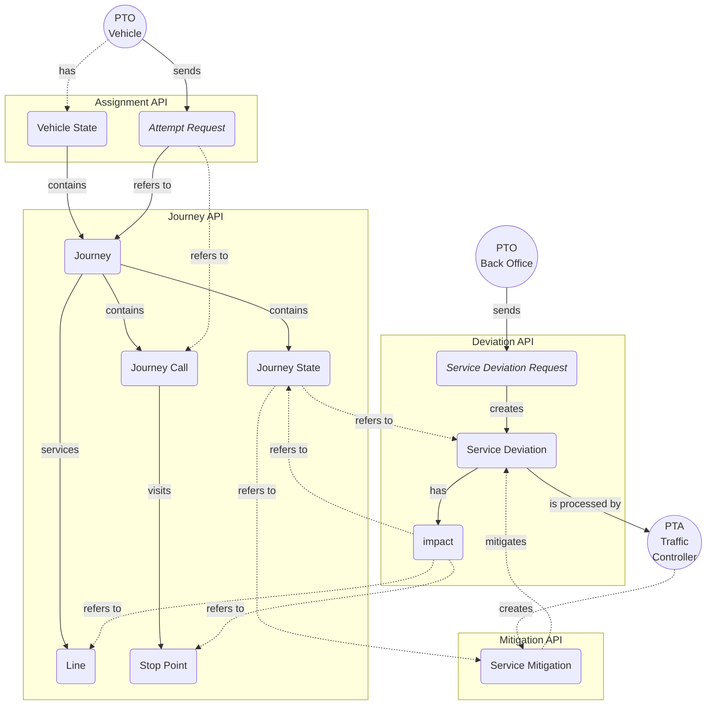
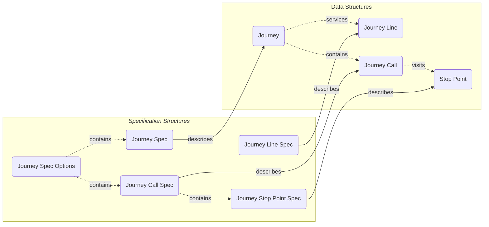

The ADT Operational API consists of these functional areas:

1. [Journey API endpoints](journey.md), for looking up up-to-date lines, stop points and journeys.
2. [Assignment API endpoints](assignment.md), for signing vehicles on and off journeys as they are being operated.
3. [Service Deviation API endpoints](deviation.md), for notifying about deviations from planned operations delivery.
4. [Service Mitigation API endpoints](mitigation.md), for mitigating deviations.
   **NOTE: This is for internal use and not available to PTOs.**

### Data Model



_Simplified data model with relationships and data flow for operational APIs._

#### Journey Identifiers

When looking up journeys via the [Journey API](journey.md), a set of three identifiers are returned for each journey:

1. `vehicleJourneyId`: Vehicle journey id assigned by PTA traffic planner. Reused across multiple operating dates.
2. `serviceJourneyId`: Service journey id assigned by PTA back-end system. Reused across multiple operating dates.
3. `datedServiceJourneyId`: Dated service journey id assigned by PTA back-end system. Unique for a specific service journey on a
    specific date.

Of these, 1.) and 2.) may be reused across multiple operating days and are therefore not unique for a specific date.

#### Journey Specification Options



_Simplified data model with relationships between specification structures and the objects they describe._

Since not all journey identifiers are unique across operating days, when signing on a vehicle via the
[Assignment API](assignment.md) or registering a service deviation for a journey via the
[Service Deviation API](deviation.md), some additional details may be required to uniquely identify a journey
on a specific date.

This structure is modeled as _journey specification options_, each describing a specific (planned) journey, a subset of
calls in a (planned) journey or an unplanned _"ad-hoc"_ journey with two properties:

1. `calls`, a list of [journey call specifications](#journey-call-specifications) identifying specific calls in a
   journey or an ad-hoc journey.
2. `journey`, a  [journey specifications](#journey-specifications) identifying a specific (planned) journey.

##### Journey Specifications

Certain API requests allow the client to provide a list of journeys when signing on a vehicle or
registering a service deviation. In such requests, the _journey specification_ structure describes a specific (planned)
journey on a specific date:

1. `lineId`, a line identifier, such as `RUT:Line:xxx`.
2. `journeyId`, one of `vehicleJourneyId`, `serviceJourneyId` or `datedServiceJourneyId`.
3. `serviceWindow`, a date-time range with a `start` and `end` timestamp, describing the complete or partial service
   window of the journey. See [Duration and Service Windows](#duration-and-service-windows) for details.

###### Mapping NeTEx Data to Journey Specifications

Example _PublicationDelivery_ section from NeTEx data file format:

```xml
<?xml version="1.0" encoding="UTF-8" standalone="yes"?>
<PublicationDelivery>
  <dataObjects>
    <CompositeFrame>
      <frames>
        <ServiceFrame>
          <routes>
            <Route id="RUT:Route:007">
              <LineRef ref="RUT:Line:1337"/>
            </Route>
          </routes>
          <lines>
            <Line id="RUT:Line:1337">
            </Line>
          </lines>
          <journeyPatterns>
            <JourneyPattern id="RUT:JourneyPattern:123456">
              <RouteRef ref="RUT:Route:007"/>
            </JourneyPattern>
          </journeyPatterns>
        </ServiceFrame>
        <TimetableFrame>
          <vehicleJourneys>
            <ServiceJourney id="RUT:ServiceJourney:1">
              <JourneyPatternRef ref="RUT:JourneyPattern:123456"/>
              <PrivateCode>505</PrivateCode>
              <passingTimes>
                <TimetabledPassingTime>
                  <StopPointInJourneyPatternRef/>
                  <DepartureTime>03:28:00</DepartureTime>
                </TimetabledPassingTime>
                <TimetabledPassingTime>
                  <StopPointInJourneyPatternRef/>
                  <DepartureTime>03:31:00</DepartureTime>
                </TimetabledPassingTime>
                <TimetabledPassingTime>
                  <StopPointInJourneyPatternRef/>
                  <ArrivalTime>03:33:00</ArrivalTime>
                </TimetabledPassingTime>
              </passingTimes>
            </ServiceJourney>
            <DatedServiceJourney id="RUT:DatedServiceJourney:a">
              <ServiceJourneyRef ref="RUT:ServiceJourney:1"/>
              <OperatingDayRef ref="RUT:OperatingDay:2024-01-01"/>
            </DatedServiceJourney>
          </vehicleJourneys>
        </TimetableFrame>
      </frames>
    </CompositeFrame>
  </dataObjects>
</PublicationDelivery>
```

Resolved values from above example for use in journey specification:
-  **lineId**: `RUT:Line:1337` value from
    ```
    PublicationDelivery/dataObjects/CompositeFrame/frames/ServiceFrame/lines/Line/@id
    ```
- **journeyId**: either of
    1. _vehicle journey id_ value `505` from
        ```
        PublicationDelivery/dataObjects/CompositeFrame/frames/TimetableFrame/vehicleJourneys/ServiceJourney/PrivateCode
        ```
    2. _service journey Id_ value `RUT:ServiceJourney:1` from
        ```
        PublicationDelivery/dataObjects/CompositeFrame/frames/TimetableFrame/vehicleJourneys/ServiceJourney/@Id
        ```
    3. _dated service journey id_ value `RUT:DatedServiceJourney:a` from
        ```
        PublicationDelivery/dataObjects/CompositeFrame/frames/TimetableFrame/vehicleJourneys/DatedServiceJourney/@id
        ```

- **serviceWindow.start**: value `2024-01-01T03:28:00+01:00`, constructed by combining
  - date of service
  - departure time of earliest passing from
    ```
    PublicationDelivery/dataObjects/CompositeFrame/frames/TimetableFrame/vehicleJourneys/ServiceJourney/passingTimes/TimetabledPassingTime/DepartureTime
    ```
  - current time-zone offset (CET).

- **serviceWindow.end**: value `2024-01-01T03:33:00+01:00`, constructed by combining
  - date of service
  - arrival time of latest passing time from
    ```
    PublicationDelivery/dataObjects/CompositeFrame/frames/TimetableFrame/vehicleJourneys/ServiceJourney/passingTimes/TimetabledPassingTime/ArrivalTime
    ```
  - current time-zone offset (CET).

##### Journey Call Specifications

Certain API requests allow the client to provide a list of calls for a journey when signing on a vehicle or
registering a service deviation. In such requests, a call must be uniquely specified within a journey, since a journey
contains multiple calls and may also contain multiple calls at the same stop point (at different times).

This structure is modeled as a _journey call specification_, consisting of three properties:

1. `stopPoint`, a [stop point specification](#journey-stop-point-specifications), indicating where this call occurs.
2. `arrivalDateTime`, a timestamp indicating the (planned) arrival time for the call.
3. `departureDatetime`, a timestamp indicating the (planned) departure time for the call.

`stopPoint` is always required to specify a call, but some calls may only have `arrivalDateTime` or `departureDateTime`
specified, which is typically the case for the first (departure only) and last (arrival only) call of a journey.


#### Journey Line Specifications

Certain API requests allow the client to provide a list of journey lines. In such requests, a line must be uniquely
identified using a _journey line specification_ consisting of two properties:

1. `lineId`, a line identifier, as returned by the [Journey API journey lines](journey.md#journey-lines) endpoint.
2. `direction`, a line direction:
   - `ANY`, indicating any line direction.
   - `INBOUND`, indicating an inbound line.
   - `OUTBOUND`, indicating an outbound line.

#### Journey Pattern Specifications

Certain API requests allow the client to target all dated journeys that run a specific journey pattern (turmønster).
In such requests, the _journey pattern specification_ structure identifies the pattern by a single property:

1. `journeyPatternId`, a NeTEx journey pattern reference, such as `RUT:JourneyPattern:008499`.

Journey pattern specifications are wrapped in a _journey pattern spec window_ that adds an optional `serviceWindow`.
See [Duration and Service Windows](#duration-and-service-windows) for how `serviceWindow` and `duration` interact to
determine which journeys are included.

#### Journey Stop Point Specifications

Since not all stop points in the operational journey database are required to have corresponding [NSR](https://developer.entur.org/pages-nsr-nsr) quay ids,
for example, if they represent stop points which are not official NSR quays, each stop point also has an associated
_API stop point id_, returned when looking up stop points via the
[Journey API stop points endpoint](journey.md#journey-stop-points).

When supplying stop point references in API requests, either (or both) of _NSR quay id_ or _stop point id_ may be
provided in the request.

This structure is modeled as a _stop point specification_ in the API, consisting of two
properties:

1. `nsrQuayId`, an NSR quay identifier, such as `NSR:Quay:xxx`.
2. `stopPointId`, a stop point id provided by the API.

Either, or both, of these properties may be provided to specify a stop point in an API request, but if both are
provided they must both reference the same stop point.

#### Duration and Service Windows

Every service deviation and service mitigation has two mechanisms for controlling which dated journeys are included in
its impact: a top-level `duration` and optional per-entry `serviceWindow` values.

##### Duration

`duration` is a date-time range at the top level of the deviation or mitigation specification. It describes the overall
active period of the event:

- `start` — when the deviation or mitigation begins. May be omitted to indicate it has already started.
- `end` — when the deviation or mitigation ends. May be omitted to indicate an open-ended event.

When `duration` is provided it acts as the default temporal constraint for every impact entry that does not have its
own `serviceWindow`. It is required unless every impact entry carries its own `serviceWindow`.

##### Service Windows

`serviceWindow` is an optional date-time range attached to individual impact entries — `lines[]`, `stopPoints[]`,
`journeyPatterns[]`, and `journeys[]`. It refines the temporal scope of that specific entry independently of the
top-level `duration`.

Unlike `duration`, a `serviceWindow` on an impact entry must have both a `start` and an `end`; open-ended service
windows are not permitted at the entry level.

##### How Duration and Service Windows Are Combined

When resolving which dated journeys are targeted by an impact entry, the effective time window is computed as the
**intersection** of the entry's `serviceWindow` and the top-level `duration`:

- The effective start is the **later** of the two starts (or the one present if only one is set).
- The effective end is the **earlier** of the two ends (or the one present if only one is set).

A journey is included in the impact if its operating window falls within the effective time window — specifically,
its first departure must be on or after the effective start, and its last arrival must be on or before the effective
end.

| `duration` | `serviceWindow` | Effective window used for journey matching |
|---|---|---|
| present | absent | `duration` |
| absent | present | `serviceWindow` |
| present | present | Intersection: `max(starts)` to `min(ends)` |
| absent | absent | No temporal constraint — all matching journeys are included |

**Example:** If `duration` spans `08:00–22:00` and a line entry has `serviceWindow` of `10:00–14:00`, only
journeys on that line departing from `10:00` and arriving by `14:00` are included. Journeys outside `10:00–14:00`
are excluded even though they fall within the `duration`.

This design allows a single deviation or mitigation to cover different time ranges for different impact entries — for
example, cancelling all journeys on line A for the full day while only cancelling journeys on line B during the
morning peak.

##### Effective Service Window

Once the targeted dated journeys have been resolved, the system derives an _effective service window_ for the deviation
or mitigation as a whole. This is the span from the earliest first departure to the latest last arrival across all
resolved journeys — i.e. the smallest contiguous time range that covers the operational activity of every affected
journey.

The effective service window is used when filtering deviations or mitigations by the `effectiveFrom` and `effectiveTo`
search parameters:

- `effectiveFrom` matches records whose effective service window **ends at or after** the given date-time — i.e.
  records still active at or after that point.
- `effectiveTo` matches records whose effective service window **starts at or before** the given date-time — i.e.
  records that have already begun by that point.

Together, the two parameters select records whose effective service window **overlaps** the given range.

Note that the effective service window reflects the journeys resolved at the time of the last background processing run.
It is updated whenever the deviation or mitigation is modified or its targeted journeys change.

### Authentication

This document outlines the procedures for getting and using authentication tokens from the Operational Auth Service for accessing other services.

| Endpoint             | URL                                                             | Description                                                                             |
|----------------------|-----------------------------------------------------------------|-----------------------------------------------------------------------------------------|
| Token                | `/api/adt/v4/operational/auth/oauth2/token`                     | Endpoint for exchanging credentials in tokens (especially access token)                 |
| JWKS                 | `/api/adt/v4/operational/auth/.well-known/jwks`                 | (Optional) Endpoint for fetching a public key to verify the retrieved access token      |
| OpenID Configuration | `/api/adt/v4/operational/auth/.well-known/openid-configuration` | (Optional) Endpoint for discovering all [OpenId Connect](https://openid.net/) endpoints |

Usage of the Operational API is restricted to Authenticated and Authorized Users only.

Ensure that the credentials used match those used for MQTT access in the respective environments.

Authentication supports an OpenId Connect authentication flow.

#### Access Tokens - Retrieve

A successful authentication yields a JSON response containing:
- `access_token`: JWT for authentication
- `token_type`: Typically "Bearer"
- `expires_in`: Token validity period in seconds
- `scope`: Granted scopes
- `id_token`: OpenID Connect ID token (if "openid" scope was requested)

HTTP request:

```bash
POST /api/adt/v4/operational/auth/oauth2/token
Authorization: Basic [base64-encoded-VALID-credentials]
Content-Type: application/x-www-form-urlencoded
grant_type=client_credentials&scope=openid
```

HTTP response:

```bash
200 OK
{
  "access_token" : "...",
  "token_type" : "Bearer",
  "expires_in" : 86400,
  "scope" : "openid",
  "id_token" : "..."
}
```

#### Access Tokens - Use

Any request should carry a Bearer Token in the `Authorization` header of HTTP requests.

The value of the Bearer token is found in the field `access_token` from the above HTTP response.

HTTP request:

```bash
GET /api/adt/v4/operational/journey/journeys?query=1001
Authorization: Bearer ...
```

HTTP response:

```bash
200 OK
""
```
Common HTTP status codes when using the token:
  - **401 Unauthorized**: Indicates an invalid, expired, or not permissioned enough token.
  - **403 Forbidden**: Signifies a valid token lacking permission for the requested resource.

In case of these errors, get a new token or verify the granted scopes.

### Common Headers

All API requests may contain one or more optional headers for tracing and request identification purposes:

| Header                                     | Description                                                                                           |
|:-------------------------------------------|:------------------------------------------------------------------------------------------------------|
| [`X-Trace-Id`](#x-trace-id-header)         | May be used to identify multiple requests as part of the same "operation" or "process".               |
| [`X-Client-Id`](#x-client-id-header)       | Optional client id indicating the logical name of the client making the API request.                  |
| [`X-Request-Id`](#x-request-id-header)     | May be used to identify a single request. Should be unique for each separate request made to the API. |
| [`X-Operator-Id`](#x-operator-id-header)   | Must be provided by clients with access to more than one PTO.                                         |
| [`X-Authority-Id`](#x-authority-id-header) | Must be provided by clients with access to more than one PTA.                                         |

#### `X-Trace-Id` Header

Optional trace id for request. May be used to trace multiple requests as part of the same "operation" or
"process". If set, should be different from [_request id header_](#x-request-id-header).

#### `X-Client-Id` Header

Optional client id for request. May be used to identify client system by name or other identifier. Note that
this is only treated as additional process metadata and not connected to authorization in any way.

#### `X-Request-Id` Header

Optional unique identifier of request. Should be unique for every request made by the client, even if the request is a
retry of a previous request with same [_trace id_](#x-trace-id-header).

#### `X-Operator-Id` Header

Optional operator id for request. Required by clients with access to more than one PTO.

Operator id on the form:

`<codespace>:Operator:<operator-number>`

> See
> [Entur list of NeTEx / SIRI codespaces](https://enturas.atlassian.net/wiki/spaces/PUBLIC/pages/637370434/List+of+current+Codespaces)
> list of valid codespace prefixes.

#### `X-Authority-Id` Header

Optional authority id for request. Required by clients with access to more than one PTA.

Authority id on the form:

`<authority-id>`
