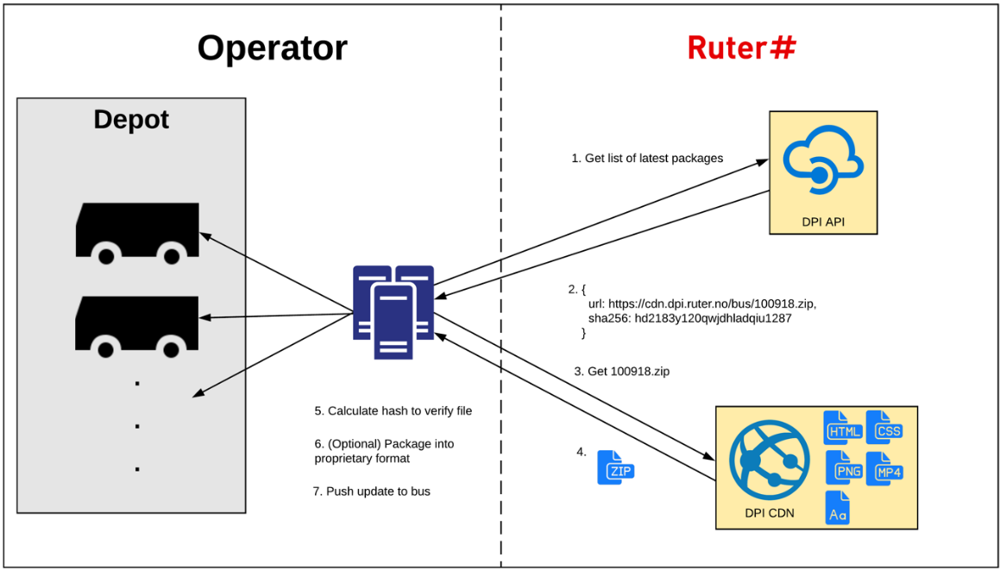
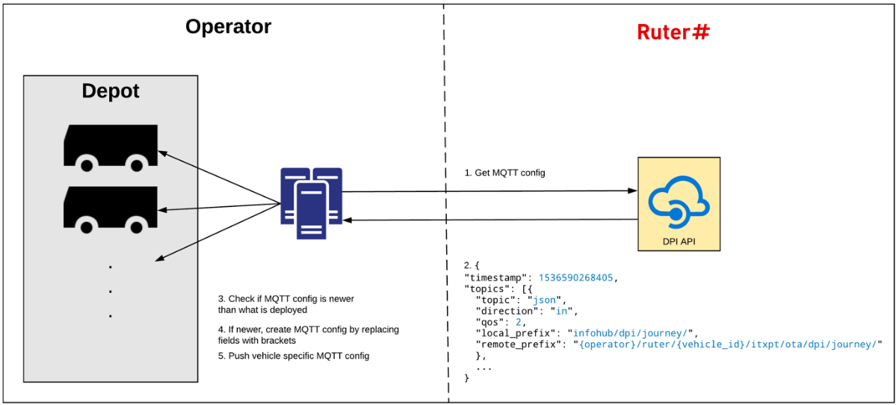

# PTO and PTA responsibilities - DPI

## Communication on board the vehicle
### Operator responsibilities:
- Make MQTT bridge available for each screen over Websockets
- Listen and publish on local MQTT topics
- NOTE: All data to be sent to Ruter Backoffice must be made available on MQTT (for example: AVL/GPS position)

### Ruters responsibilities:
- Send messages to the MQTT bridge for real-time information
- Define and document the configuration of Websockets (the port)

## Browser
### Operator responsibilities:
- Install, upgrade and monitor browser in each individual screen.
- Set up the browser to display predefined screens that match the screen size, location and function
- Ensure that when starting the screens that the correct screen is always displayed
- Monitor that the browser displays a html page provided by Ruter.
- Monitor that all browsers receive messages and acknowledge messages.
- Monitor the browser for any errors in the console, and possibly reload the page if problems occur
- Provide first-line support/troubleshooting should a problem arise

#### See also 
- [Browser Requirements](browser-requirements.md)  

### Ruters responsibilities:
- Updating the content on the screen using mqtt over websockets
- Define and document the setup of the screens

## Updating static content

### Operator responsibilities:
- Download static content pack(s) from Routers regularly
  - At least once a day
  - If it only happens once, then the download must take place after 16:00 each day, and be available in the vehicle until the following day
- Validate that the package has been downloaded correctly (SHA hash verification)
- Set aside 16GB of storage capacity in the vehicle for storing static files
  - Typically MP4, HTML, JS, images, mp3 etc.
  - NOTE: the entire capacity of 16GB must be able to be used for DPI content. That is when the contents are to be extracted, the router's zip file must be in a different area than the destination files.
- Push out new content packs to the vehicles when they are in the depot and before they are in traffic the next day
  - NOTE: Only files that have changed since the previous version should be transferred to the vehicle. Changes must be diffused and synchronized, e.g. with a tool like rsync.
- Updates will come on two channels:
    - Stage
        - planned changes come here first, and must be verified that they work on a test vehicle by the operator, before they are promoted to prod.
        - All errors discovered must be reported to Ruter's bug tracking system.
    - Prod
        - Planned changes come here after being verified on stage.
        - In cases where there are errors in production, updates can come here without having gone through stage verification.

#### See also
- [Packages](packages.md)
- [Resources](resources.md)

### Ruters responsibilities:
- Define and document the format and use of the configuration message
- Provide endpoints that specify the URLs and SHA hash signatures of the content packages
- Make content packs available for download

## Update of MQTT configuration

### Operator responsibilities:
- Download configuration updates from Router regularly
- This must happen at the same time as the check of static content
- Build up vehicle-specific configurations based on Ruter's configuration
    - Insert variable names where needed
    - Example : `{operator}/router/{vehicle_id}/adt/v3/pe/dpi/journey`
    translates to: `alpha/router/990552/adt/v3/pe/dpi/journey`
- Push out new content packs to the vehicles when they are in the depot and before they are in traffic the next day
- Updates will come on two channels:
    - Stage
        - planned changes come here first, and must be verified that they work on a in-house virtual vehicle by the operator, before they are promoted to prod.
        - All errors discovered must be reported to Ruter's bug tracking system.
    - Prod
        - Planned changes come here after being verified on stage.
        - In cases where there are errors in production, updates can arrive here without having been through stage verification.
    
### Ruters responsibilities:
- Define and document the format and use of the configuration message
- Make configuration available to all MQTT topics on an endpoint
- Make both Stage and Prod versions available

## Playback of sound
### Operator responsibilities:
- Play audio received as base64-encoded OPUS or mp3 message over local MQTT topic
- Play audio message referring to local audio file.
- The message contains the expiryTimestamp. When receiving a message after expiry of the expiryTimestamp, the message must not be played
- The message can contain several sound files in an array, in these cases they must be played in the order in which they are received in the array.
- Processing of MQTT messages must be synchronous. That is a message must be processed and the audio message finished playing before a new message can be processed.

### Ruters responsibilities:
- Produce audio messages on the MQTT bridge
- Define and document changes in the MQTT message for audio.

## Clock synchronization
### Operator responsibilities:
- Ensure that all devices on board have synchronized clocks that follow NTP
    - Includes: Browsers / monitors and audio playback unit

### Ruters responsibilities:
- Only use the device's system clock where there is a need to know the time.

## Mobile data usage
### Operator responsibilities:
- Always have mobile data activated
- If the data package/quota is used up, the data traffic cannot be interrupted or throttled
- Synchronization of static files to the vehicle must be done using a tool that supports incremental changes (i.e. only files that have changed should be transferred)
- The browsers must have access to internet-based content. (eg. displaying map in relation with a deviation)

### Ruters responsibilities:
- Limit the scope of static and dynamic content updates
- Preferably use local content on board the bus in cases where it is practically possible
- Use caching in the browser to limit data usage on the internet

## General information about reporting errors
### Operator responsibilities:
- If errors are detected in the DPI solution, the operator should report errors to Ruter's bugtracking system
- Errors that are reported must contain as much technical information as possible to reproduce the error. For example:
    - stack traces
    - screenshots
    - place
    - time
    - journey
    - vehicleid
- The operator must make technical personnel available when troubleshooting/debugging is required

### Ruters responsibilities:
- Answer and investigate error messages that are reported

