# DPI Vehicle Display Screen Configuration

DPI Vehicle Display needs to be set up with two config parameters:

- `CLIENT_ID` - a unique identifier for the client, used to identify the vehicle. Must be a UUIDv4.
- `SCREEN_TYPE_ID` - a unique identifier for the screen type, used to determine the layout and content of the display.

You can safely generate a UUIDv4 for the `CLIENT_ID` using uuidgen:

```bash
$ uuidgen
58B02C19-C321-493E-B9D4-366B58E627D2
```

The `CLIENT_ID` and `SCREEN_TYPE_ID` are applied in the URL.

- `CLIENT_ID` in the query string as `clientId=<INSERT_CLIENT_ID>`
- `SCREEN_TYPE_ID` in the fragment as `#display/<INSERT_SCREEN_TYPE_ID>`

A `PHYSICAL_ID` can also be specified, to easily identify screens on board

- `PHYSICAL_ID` in the query string as `physicalId=<INSERT_PHYSICAL_ID>`

The URL should be structured as follows:

```
http://webserver.local/app/?clientId=<INSERT_CLIENT_ID>&physicalId=<INSERT_PHYSICAL_ID>#display/<INSERT_SCREEN_TYPE_ID>
```

## Overview of screen types

| ID       | Content                                  | Aspect ratio | Optimal screen resolution (width x height) | Vehicle type   |
| -------- | ---------------------------------------- | ------------ | ------------------------------------------ | -------------- |
| 1        | Vertical journey, Public Announcement    | 32:9         | 1920x540                                   | Bus            |
| 2        | Horizontal journey                       | 48:9         | 1920x360                                   | Bus            |
| 3        | Vertical journey                         | 16:9         | 1920x1080, 960x540                         | Bus            |
| 4        | Vertical journey / Public Announcement   | 16:9         | 1920x1080, 960x540                         | Bus            |
| 5-left   | Horizontal journey                       | 32:9         | 1920x540                                   | Bus            |
| 5-right  | Horizontal journey                       | 32:9         | 1920x540                                   | Bus            |
| 6        | Vertical journey                         | 16:5         | 1920x600                                   | Bus            |
| t2-left  | Horizontal journey                       | 1920:197     | 1920x197                                   | Tram (SL18)    |
| t2-right | Horizontal journey (reverse)             | 1920:197     | 1920x197                                   | Tram (SL18)    |
| t3       | Next stop / destination                  | 128:9        | 1920x285                                   | Tram (SL18)    |
| b1       | Vertical journey                         | 16:9         | 1920x1080                                  | Ferry (Boreal) |
| b2       | Next stop, sensors / Public Announcement | 16:9         | 1920x1080                                  | Ferry (Boreal) |
| b3       | Next stop, Public Announcement           | 9:16         | 1080x1920                                  | Ferry (Norled) |
| b4       | Boat primary                             | 16:9         | 1920x1080                                  | Ferry          |

\* These are approx. values and subject to change.

## Handling filtering short platform notifications for SL18 trams

If you want to hide the "short platform" notifications on the displays at the front half of the tram, you can add the following part to the query string:

`?sl18Half=c1` or `?sl18Half=c2`

This will make "short platform" notifications hidden if the active cab is the same as this query parameter (meaning the screen is in the "front half" of the tram).

## Annotating precise location on board SL18 trams

Screens on SL18 trams should also note their location within the tram using `?sl18Placement=` query parameter.

`t2-left` and `t2-right` screens should have their respective door number as their `sl18Placement`, e.g `sl18Placement=2-3`.

`t3` screens should have their `sl18Placement` as a number counting from 1 - 10, where `sl18Placement=1` is the screen closes to the driver seat in C1. Counting upwards through the tram to `sl18Placement=10` on the screen closest to the driver seat in C2.

See illustration of SL18 screens and their expected `sl18Placement=` parameter:

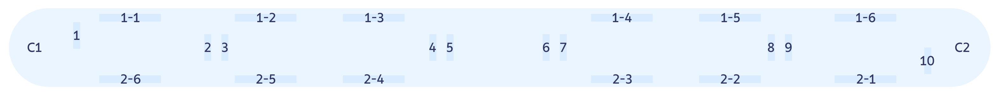

**Full example**

```
http://webserver.local/app/?clientId=3d914034-f8c4-2573-19fe-49d41966d689&physicalId=10.0.0.4&sl18Half=c2&sl18Placement=2-3#display/t2-left
```

## Screen configurations for bus (TaaS vehicles)

### Screen config 1

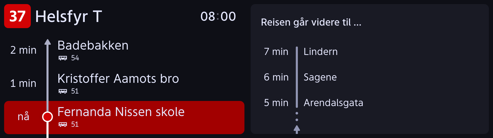
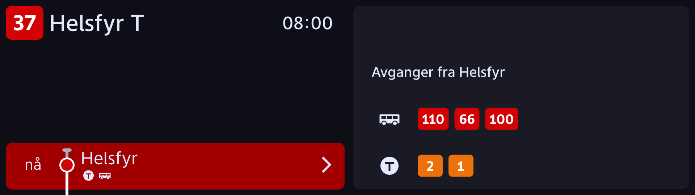

Running state of config 1, displaying journey (50% of the width) and additional information (fallback, when no public announcements\* are showing).

This is the default configuration used for 32:9, and most 32:9 screens should be configured to use this configuration.

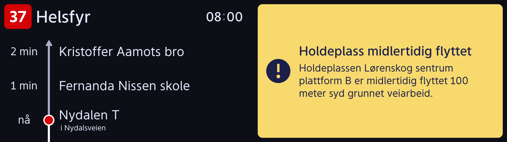

Config 1 showing an example of public announcement.

\*The public announcements are either html campaigns, texts, video and images.

### Screen config 2

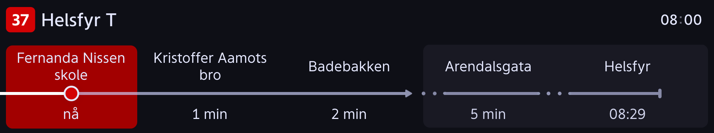

Running state of config 2.
This is the only configuration used for 48:9, and _all_ 48:9 screens must be configured to use this configuration.

### Screen config 3

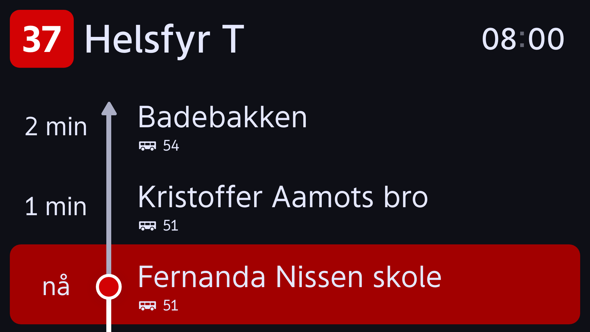

Running state of config 3.
Intended for screens dedicated to showing journey, i.e. no public announcements will be displayed on this screen.

### Screen config 4


Running state of config 4.
Default state for config 4 is showing journey.

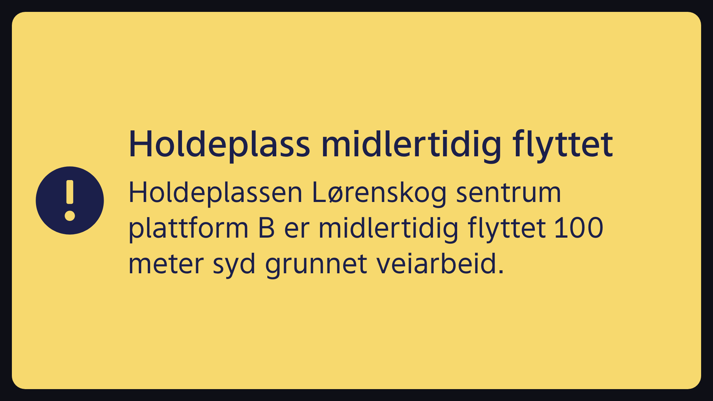

Active public announcements will replace journey.

### Screen config 5-left and 5-right

This configuration is used to display a horizontal view of the line, on a 32:9 display.

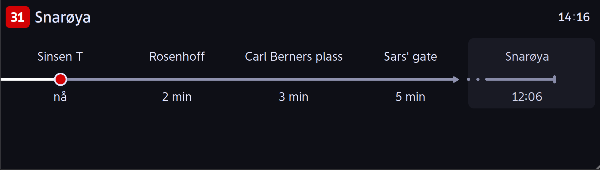

### Screen config 6

This configuration is used to display a vertical view of the line, on a 16:5 display.

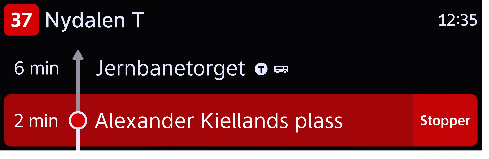

### Assignment of screen config id for screens

General rule of thumb for assignment of configuration id:

1. All 32:9 (1920x540) screens should usually be assigned config 1
2. All 48:9 (1920x360) screen should always be assigned config 2
3. All 16:9 (1920x1080 or 960x540) should always be assigned config 3, if any of these conditions are met:
   1. This is the only screen on board
   2. This screen is in front of the bus
4. Screen config 4 is used for the _right_ screen when 2x 16:9 screens are horizontally aligned, facing the same way (cf. example 1). (For all other 16:9 screens, use config 3)
5. Screen config 5 is used for the 32:9 screens are vertically aligned. (For all other 32:9 screens, use config 1)

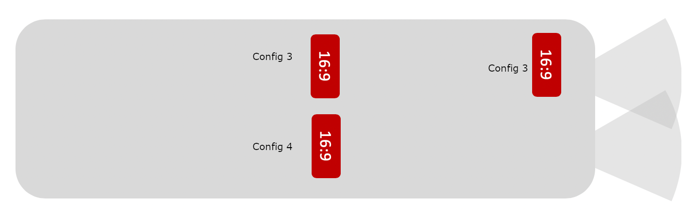

## Screen configurations for tram (SL18)

### Screen config t2-left

Left side of the tram when active cab is c1.

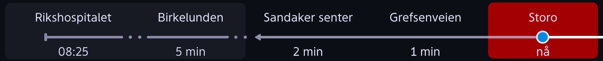

Running state of t2-left. This is the only state (cf. [troubleshooting](/troubleshooting-client) for this config.

### Screen config t2-right

Right side of the tram when active cab is c1.

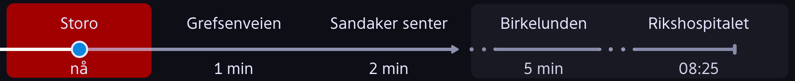

Running state of t2-left. This is the only state (cf. [troubleshooting](/troubleshooting-client) for this config.

### Screen config t3

#### State 1 - doors unlocked

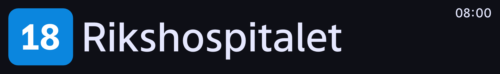

#### State 2 - next stop produced

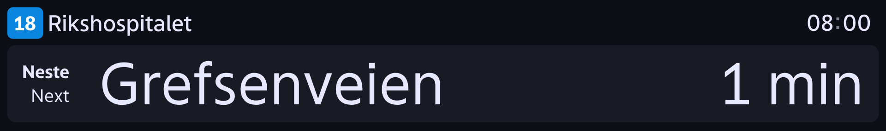

#### State 3 - next stop produced with active stop signal

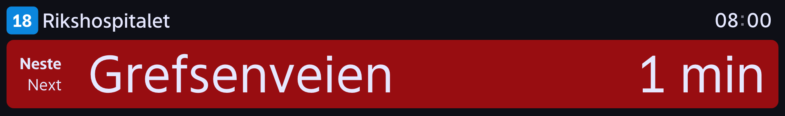

## Screen configurations for ferry (Boreal)

### Screen config b1

Running state of config b1. Intended for screens dedicated to showing journey, i.e. public announcements (such as safety instructions etc) are ignored.
This should be used for on the left screen in pair with config b2.

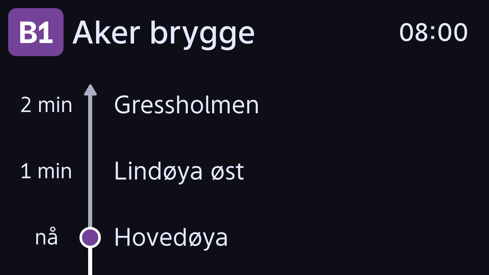

### Screen config b2

Secondary information, intended for displaying safety announcements, deviations and other media content types.
When there is no active media content playing, the screen will show information about next stop, destination and sensor information from the ferry as fallback. The sensor data is derived from following topics:

- telemetry/01001016 - water temperature
- telemetry/01001011 - temperature outside (ambient)
- weather - wind data

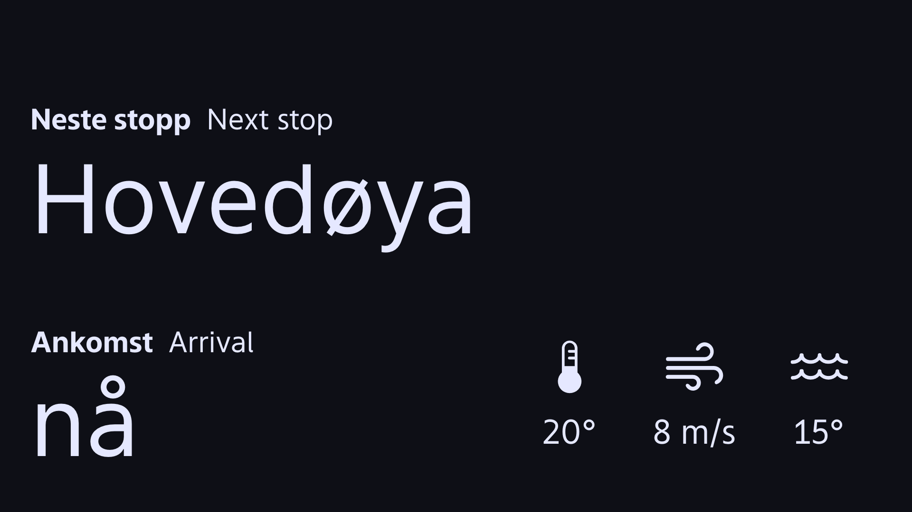


### Screen config b3

Running state of config b3. Intended for screens in portrait mode showing journey on map, public announcements are shown.

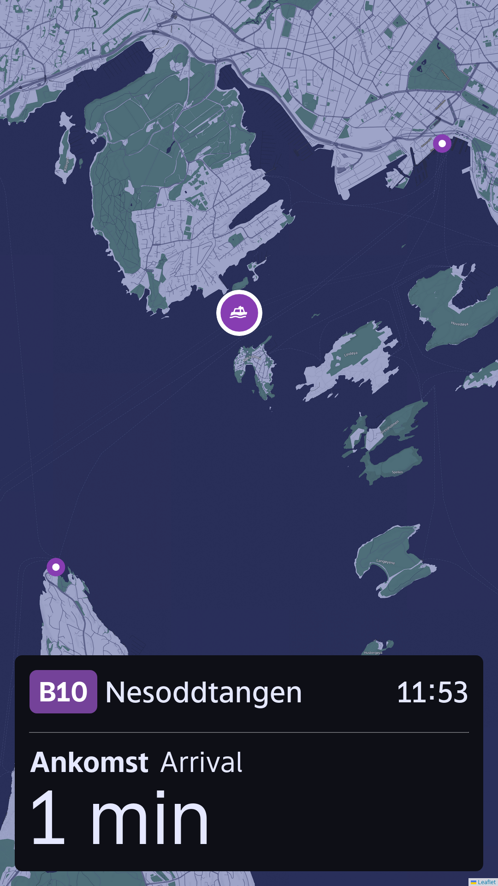

### Screen config b4

Running state of config b4

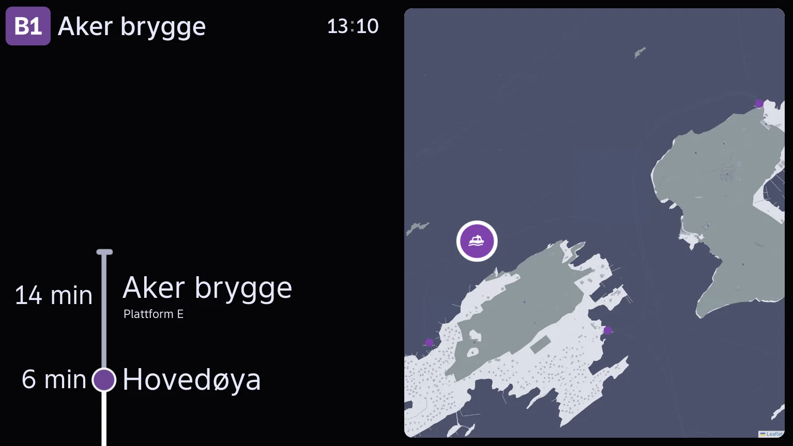
