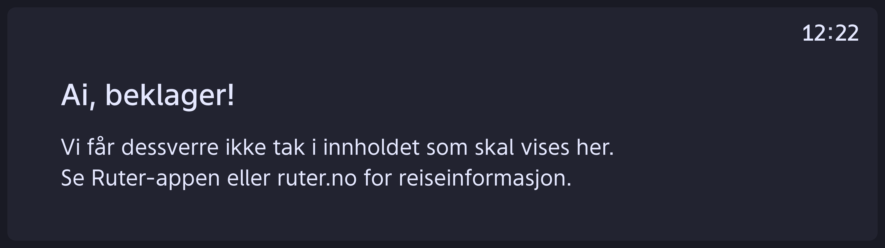
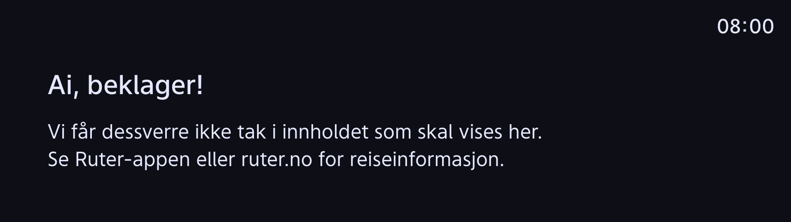
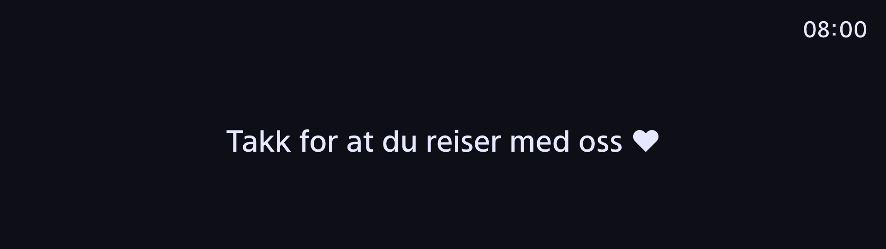

# Troubleshooting client

### Locating screen
 When setting up screen a `physicalId` may be passed to the application with querystring.
 For example: http://webserver.local/app/?physicalId=screen1#/display/1.
 This can be anything the operator feels helps them to locate the screen.

 The application will use the value in all diagnostic messages like this (simplified)
 ```
 {
   "clientId": "f72a138ffada1E41ccc8ad",
   ...
   "type": "STATUS",
   "payload": {
     "physicalId": "screen1",
     ...
   }
 }
 ```

### Known situations and client fallbacks 
Listed below are situations that may occur and how these situations are indicated in busmonitor application.
#### Unable to establish connection to local mqtt-bridge


Note the slightly blueish gray background color.

This means the client is unable to connect to the `ws://mqtt-broker:9883/mqtt` endpoint.
##### Checklist:
 1. Make sure the host `mqtt-broker` is pointing to the ip address of the mqtt bridge in your host file (for Unix based systems: `/etc/hosts`)
 2. Make sure the mqtt-broker is running and allows anonymous connections. Authentication to the remote mqtt-broker is done in your mqtt-bridge config.

#### No journey received


This means the client has established a connection to the mqtt-broker, but at the point of time has not received a journey.
It may or have not received data on other topics. 

##### Checklist:
 1. Verify that the topics mappings in mqtt-bridge config are correct, 
    e.g. ```topic json in 1 infohub/dpi/journey/ operator_name/ruter/vehicle_id/itxpt/ota/dpi/journey/```
 2. Use a mqtt-client to subscribe to wildcard (`#`) in order to inspect incoming data and on which topics they are being sent.


#### Dead run
The journey qualifies as a dead-run when the public code of the line equals `0`, route id is `RUT:Route:0`, or journey id includes a substring of `RUT:DeadRun:0`.




### Error Codes

We want to reduce technical jargon to passengers onboard the vehicle. We still need some technical info when debugging issues however.

Here is a list of the possible error codes we show in the bottom right corner of the screen:

* `NOC` – Client lost connection to MQTT broker (ws://mqtt-broker:9883)
* `NOJ` – Client has not received any journey message
* `EDO` – Client received an external display override message (driver decided to show something else on external displays)
* `DER` – Client received a journey message indicating this vehicle should not be transporting passengers (commonly referred to as a deadrun)
* `OFR` – The client received an eta-message with information indicating the vehicle has deviated from its planned route.